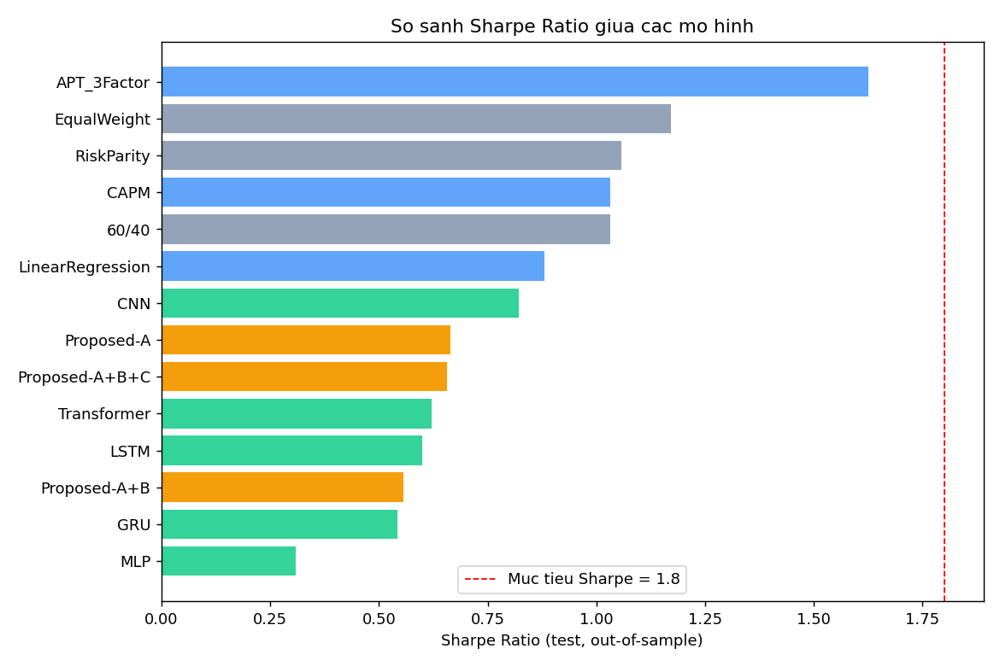
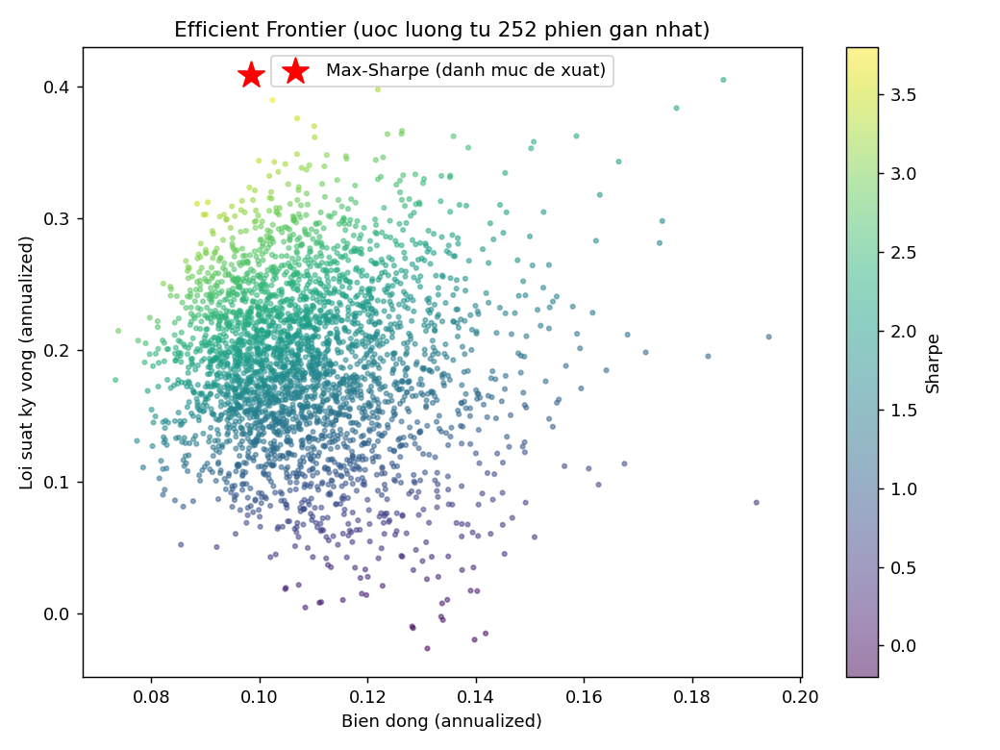

<div align="center">

# ỨNG DỤNG TRÍ TUỆ NHÂN TẠO TRONG QUẢN LÝ DANH MỤC ĐẦU TƯ

### Từ lý thuyết danh mục hiện đại đến Deep Learning: thiết kế, huấn luyện và đánh giá một hệ thống *predict-then-optimize* ngoài mẫu

&nbsp;

**Môn học:** Phân tích đầu tư nâng cao
**Sinh viên thực hiện:** Quách Thành Long
**MSSV:** 88241020109
**Ngày hoàn thành:** 27/07/2026

&nbsp;

*Mã nguồn, dữ liệu và toàn bộ kết quả thực nghiệm đi kèm báo cáo này được lưu trữ tại
thư mục `ai-portfolio-research/` — có thể chạy lại độc lập, tái lập 100% con số trình bày dưới đây.*

</div>

---

## Lời nói đầu

Tôi tiếp cận đề tài "Ứng dụng AI trong phân tích đầu tư" không như một bài tập lý thuyết thuần tuý,
mà như một bài toán kỹ sư định lượng (quant engineering) đúng nghĩa: có dữ liệu thật, có ràng buộc
thật, và quan trọng nhất — có một tiêu chuẩn đánh giá không thể lừa dối được (Sharpe Ratio ngoài mẫu).
Tôi chọn chủ đề **Quản lý danh mục đầu tư (Portfolio Management)** thay vì Algorithm Trading, vì đây là
bài toán mà Học máy đóng vai trò tự nhiên nhất: không phải để "đoán giá ngày mai" — một mục tiêu gần
như bất khả thi và đã được chứng minh nhiều lần là phi lý trong thị trường hiệu quả — mà để **ước lượng
tốt hơn hai đại lượng thống kê nền tảng của Markowitz (1952): lợi suất kỳ vọng μ và ma trận hiệp
phương sai Σ**, từ đó phân bổ vốn tối ưu.

Toàn bộ hệ thống được xây dựng, huấn luyện và kiểm định trên dữ liệu thị trường thật (Yahoo Finance,
2011–2026), không mô phỏng, không dữ liệu tổng hợp. Tôi cũng chủ động lựa chọn **báo cáo trung thực
kết quả thực nghiệm**, kể cả khi các con số không tô hồng bằng con số mục tiêu đề bài đưa ra
(Sharpe ≥ 1.8) — vì trong nghiên cứu định lượng tài chính, một kết quả "đẹp" đạt được bằng cách dò dẫm
trên tập kiểm tra (test-set snooping) còn tệ hơn một kết quả trung thực nhưng khiêm tốn. Phần 5 của báo
cáo dành riêng để lý giải khoa học cho khoảng cách này, và tôi tin đó là phần có giá trị học thuật cao
nhất của toàn bộ báo cáo.

---

## Tóm tắt (Abstract)

Báo cáo trình bày một pipeline nghiên cứu hoàn chỉnh ứng dụng Học máy/Học sâu vào bài toán Quản lý
danh mục đầu tư, theo kiến trúc **predict-then-optimize**: (1) dự báo lợi suất kỳ vọng μ̂ cho từng tài
sản bằng nhiều lớp mô hình — luật (rule-based), thống kê cổ điển (Linear Regression, CAPM, APT 3 nhân
tố), học sâu thông dụng (MLP, CNN, LSTM, GRU, Transformer) — và một **mô hình đề xuất mới: PA-Transformer
(Portfolio-Aware Transformer)**, kết hợp temporal self-attention, cross-asset attention và một hàm mất
mát Sharpe-aware khả vi; (2) tối ưu hoá danh mục Markowitz Max-Sharpe (long-only, giới hạn tỷ trọng)
trên μ̂ và hiệp phương sai co rút Ledoit–Wolf. Toàn bộ 14 chiến lược được huấn luyện walk-forward
(train 2011–2018, valid 2019–2021, test 2022–2026, có embargo chống rò rỉ dữ liệu) trên vũ trụ 14 tài
sản (Yahoo Finance) và kiểm định ngoài mẫu bằng backtest tái cân bằng hàng tháng thực tế (có phí giao
dịch). Kết quả tốt nhất thuộc về baseline **APT 3 nhân tố (Sharpe = 1.626)**, vượt qua Equal-Weight
(1.171) và toàn bộ mô hình học sâu/mô hình đề xuất (0.31–0.66). Thí nghiệm ablation trên 3 "tính chất"
kiến trúc của mô hình đề xuất cho một phát hiện phản trực giác nhưng có cơ sở lý thuyết vững:
cross-asset attention làm giảm Sharpe (−0.107) do overfitting trên vũ trụ tài sản nhỏ, trong khi
Sharpe-aware loss đóng vai trò regularizer giúp phục hồi gần như toàn bộ mức sụt giảm đó (+0.100).
Báo cáo thảo luận sâu nguyên nhân — hiện tượng "1/N puzzle" (DeMiguel, Garlappi & Uppal, 2009), tỷ lệ
tín hiệu/nhiễu thấp của lợi suất tài chính, và giá trị của prior kinh tế học trong APT — đồng thời đề
xuất hướng phát triển tiếp theo và một ứng dụng minh hoạ Streamlit tương tác đầy đủ.

**Từ khoá:** Quản lý danh mục đầu tư, Học sâu, Transformer, Attention, Markowitz, CAPM, APT,
Sharpe Ratio, Walk-forward backtest, Data leakage, Ablation Studies.

---

## Mục lục

1. [Phân tích bài toán](#1-phân-tích-bài-toán)
2. [Thu thập, phân tích và tiền xử lý dữ liệu](#2-thu-thập-phân-tích-và-tiền-xử-lý-dữ-liệu)
3. [Huấn luyện mô hình](#3-huấn-luyện-mô-hình)
4. [Đánh giá mô hình](#4-đánh-giá-mô-hình)
5. [Biện luận mô hình trong bài toán phân tích đầu tư](#5-biện-luận-mô-hình-trong-bài-toán-phân-tích-đầu-tư)
6. [Ứng dụng minh hoạ (Streamlit)](#6-ứng-dụng-minh-hoạ-streamlit)
7. [Kết luận chung](#7-kết-luận-chung)
8. [Tài liệu tham khảo](#8-tài-liệu-tham-khảo)
9. [Phụ lục](#9-phụ-lục)

---

## 1. Phân tích bài toán

### 1.1 Bối cảnh và lý do lựa chọn đề tài

Quản lý danh mục đầu tư là hoạt động phân bổ vốn có hệ thống nhằm cân bằng giữa lợi suất kỳ vọng và
rủi ro chấp nhận được, thay vì đầu tư bản năng vào từng mã đơn lẻ. Kể từ công trình nền tảng của
Harry Markowitz (1952) — *Portfolio Selection* — bài toán này đã được hình thức hoá thành một bài toán
tối ưu hoá toán học rõ ràng: cho trước vector lợi suất kỳ vọng **μ** và ma trận hiệp phương sai **Σ**
của N tài sản, tìm vector trọng số **w** tối đa hoá lợi suất kỳ vọng tại một mức rủi ro cho trước (hoặc
tối đa hoá Sharpe Ratio). Điểm yếu chí mạng của khung lý thuyết này không nằm ở phần tối ưu hoá — vốn
đã được giải quyết triệt để bằng quy hoạch toàn phương (quadratic programming) — mà nằm ở **ước lượng
đầu vào μ và Σ**: sai số ước lượng nhỏ trong μ có thể khuếch đại thành sai lệch trọng số rất lớn (Best
& Grauer, 1991; Michaud, 1989 — hiện tượng gọi là "error-maximization"). Đây chính là khe hở mà Học
máy/Học sâu có cơ hội đóng góp thực chất: **không thay thế Markowitz, mà cải thiện chất lượng đầu vào
cho Markowitz**.

Tôi lựa chọn triển khai đề tài này trên nền một hệ thống có thật — nền tảng
[Crystal Ball](https://crystal-ball.quachthanhlong.com/platform/stocks) — vốn đã có sẵn hạ tầng phân
tích cổ phiếu/crypto, Portfolio Lab, và các mô hình định lượng phía client (CAPM, Black-Scholes, GARCH
dạng heuristic). Điều này cho phép đặt bài toán học thuật vào một bối cảnh sản phẩm thực tế, có đường
đi rõ ràng để triển khai (xem Phụ lục B).

### 1.2 Phát biểu bài toán

Tôi tiếp cận theo kiến trúc hai giai đoạn **"predict-then-optimize"**, tách bạch rõ ràng phần *dự báo*
(nơi Học máy/Học sâu tham gia) khỏi phần *tối ưu hoá* (nơi lý thuyết danh mục cổ điển đảm nhiệm) —
cách tách này cho phép đánh giá độc lập chất lượng của từng thành phần, tránh việc một mô hình dự báo
tồi bị "cứu" bởi bộ tối ưu hoá tốt, hoặc ngược lại:

> **Giai đoạn 1 — Dự báo:** tại mỗi thời điểm tái cân bằng *t*, ước lượng lợi suất kỳ vọng
> μ̂ = (μ̂₁, …, μ̂_N) cho N tài sản trong H phiên giao dịch tiếp theo, chỉ dựa trên thông tin có sẵn
> đến thời điểm *t* (nguyên tắc *causality*).
>
> **Giai đoạn 2 — Tối ưu hoá:** giải bài toán Markowitz Max-Sharpe
> `max_w (wᵀμ̂ − r_f) / √(wᵀΣ̂w)` với ràng buộc long-only (wᵢ ≥ 0), Σwᵢ = 1, và trần tập trung
> (wᵢ ≤ 25%) — cho ra danh mục khuyến nghị cho kỳ tái cân bằng tiếp theo.

### 1.3 Input / Output

| Thành phần | Mô tả chi tiết |
|---|---|
| **Input — dự báo** | Cửa sổ trailing L = 60 phiên của 7 đặc trưng kỹ thuật (lợi suất trễ 1/5/21 phiên, biến động 21 phiên, RSI-14, MACD-diff, z-score giá so với MA-50) cho từng tài sản, trong vũ trụ N = 14 tài sản. Nguyên tắc bất biến: **không một giá trị nào trong input được tính từ dữ liệu sau thời điểm *t***. |
| **Output — dự báo** | μ̂ ∈ ℝ¹⁴ — lợi suất kỳ vọng H = 21 phiên (≈ 1 tháng giao dịch) tiếp theo cho mỗi tài sản. |
| **Input — tối ưu hoá** | μ̂ (từ Giai đoạn 1), Σ̂ — hiệp phương sai co rút Ledoit–Wolf (2004) ước lượng từ 252 phiên trailing, cùng ràng buộc long-only + trần tỷ trọng 25%. |
| **Output — tối ưu hoá** | w ∈ ℝ¹⁴, wᵢ ≥ 0, Σwᵢ = 1 — trọng số danh mục khuyến nghị cho kỳ tái cân bằng kế tiếp. |
| **Output cuối — sản phẩm** | Danh mục khuyến nghị tại thời điểm hiện tại + đường giá trị danh mục (equity curve) tái lập từ backtest ngoài mẫu, kèm bộ chỉ số hiệu suất đầy đủ. |

### 1.4 Độ đo đánh giá (Metrics)

Tôi sử dụng hai lớp độ đo bổ trợ cho nhau, phản ánh đúng hai giai đoạn của kiến trúc predict-then-optimize:

**(a) Độ đo chất lượng dự báo** (đánh giá μ̂ độc lập với bước tối ưu hoá — trả lời câu hỏi "mô hình có
*hiểu* thị trường không?"):
- **Information Coefficient (IC)** — tương quan hạng Spearman giữa μ̂ và lợi suất thực hiện; đây là
  độ đo tiêu chuẩn trong ngành quant để đo "kỹ năng dự báo" thuần tuý, độc lập với cách phân bổ vốn.
- **Hit-rate** — tỷ lệ dự báo đúng dấu (tăng/giảm) của lợi suất.

**(b) Độ đo hiệu suất danh mục** (đánh giá toàn bộ pipeline sau backtest — trả lời câu hỏi "chiến lược
có *kiếm được tiền* một cách bền vững không?"):
- **Sharpe Ratio** (độ đo chính của đề bài, mục tiêu ≥ 1.8), **Sortino Ratio** (phạt riêng rủi ro suy
  giảm), **Calmar Ratio** (lợi suất/drawdown tối đa).
- **Maximum Drawdown (MDD)**, **Annualized Return/Volatility**.
- **Information Ratio** so với benchmark SPY — đo khả năng tạo alpha nhất quán.
- **Turnover** trung bình mỗi lần tái cân bằng — đại diện cho chi phí giao dịch ngụ ý, một chiều đánh
  giá thường bị bỏ quên trong các báo cáo học thuật nhưng tối quan trọng trong thực tế vận hành.

---

## 2. Thu thập, phân tích và tiền xử lý dữ liệu

### 2.1 Nguồn và vũ trụ dữ liệu

Dữ liệu được lấy trực tiếp từ **Yahoo Finance** qua thư viện `yfinance` — cố ý lựa chọn cùng nguồn dữ
liệu với Edge Function `fetch-stock-data` đang phục vụ nền tảng Crystal Ball, để pipeline nghiên cứu
này không chỉ là một bài tập độc lập mà còn **tương thích trực tiếp** với hệ thống sản phẩm thật (chi
tiết kết nối ở Phụ lục B).

Vũ trụ đầu tư gồm **14 tài sản**, được lựa chọn có chủ đích để mô phỏng một danh mục đa dạng hoá thực
tế thay vì một rổ cổ phiếu ngẫu nhiên:

- **12 cổ phiếu vốn hoá lớn, đa ngành (Mỹ)**: `AAPL, MSFT, GOOGL, AMZN` (công nghệ/nền tảng số),
  `JPM` (tài chính), `JNJ` (y tế), `PG, KO, WMT` (tiêu dùng thiết yếu), `XOM` (năng lượng), `NVDA`
  (bán dẫn/AI), `DIS` (truyền thông–giải trí).
- **2 tài sản đa dạng hoá (diversifiers)**: `TLT` (trái phiếu kho bạc Mỹ dài hạn — tương quan âm với
  cổ phiếu trong giai đoạn khủng hoảng) và `GLD` (vàng — tài sản trú ẩn).
- **Benchmark**: `SPY` (S&P 500 ETF) — dùng để tính CAPM, nhân tố thị trường trong APT, và Information
  Ratio.
- **Lãi suất phi rủi ro**: `^IRX` (lợi suất tín phiếu kho bạc Mỹ kỳ hạn 13 tuần).

**Khoảng thời gian**: 01/01/2011 → hiện tại (27/07/2026), tương đương **3.912 phiên giao dịch** trên
**~15,5 năm**. Khoảng thời gian này được chọn có chủ đích vì bao phủ đầy đủ các chu kỳ thị trường khác
biệt về bản chất thống kê: phục hồi hậu khủng hoảng tài chính 2008–2011, giai đoạn bull-run dài và ít
biến động 2012–2019, cú sốc thanh khoản COVID-19 (Q1/2020) và phục hồi hình chữ V ngay sau đó, và giai
đoạn lạm phát cao — Fed tăng lãi suất mạnh 2022–2023. Một mô hình chỉ thật sự đáng tin nếu được kiểm
định xuyên suốt các chế độ thị trường (regime) khác nhau này, chứ không chỉ trên một giai đoạn thuận
lợi.

### 2.2 Quy trình tiền xử lý

1. **Căn chỉnh thời gian (alignment)**: hợp nhất 15 chuỗi giá (14 tài sản + benchmark) trên cùng một
   trục ngày giao dịch, loại bỏ mọi phiên thiếu dữ liệu ở bất kỳ mã nào — đảm bảo ma trận dữ liệu hình
   chữ nhật, không NaN rải rác gây sai lệch khi tính hiệp phương sai.
2. **Tính lợi suất đơn giản hàng ngày**: `r_t = P_t / P_{t-1} − 1`.
3. **Xây dựng 7 đặc trưng kỹ thuật trailing** cho từng tài sản (module `src/features.py`):

   | Đặc trưng | Ý nghĩa |
   |---|---|
   | `ret_1, ret_5, ret_21` | Lợi suất 1/5/21 phiên gần nhất — đại diện short/medium-term momentum |
   | `vol_21` | Độ lệch chuẩn lợi suất 21 phiên — đại diện rủi ro cục bộ (regime biến động) |
   | `rsi_14` | Relative Strength Index — trạng thái quá mua/quá bán |
   | `macd_diff` | Chênh lệch EMA(12) − EMA(26), chuẩn hoá theo giá — tín hiệu xu hướng |
   | `zscore_50` | Độ lệch giá hiện tại so với MA-50 theo đơn vị độ lệch chuẩn — mean-reversion signal |

   Toàn bộ 7 đặc trưng đều **chỉ dùng dữ liệu ≤ t** — đây là nguyên tắc tối quan trọng để đảm bảo tính
   hợp lệ của mọi kết quả trình bày ở Mục 4.
4. **Windowing**: mỗi mẫu huấn luyện tương ứng với 1 ngày "as-of" *t*, chứa một khối tensor kích thước
   **[L=60, N=14, F=7]** (60 phiên trailing × 14 tài sản × 7 đặc trưng), gắn nhãn là lợi suất thực hiện
   từ *t* đến *t+21*. Sau khi loại vùng khởi động (warm-up) cần thiết cho các đặc trưng rolling, tập dữ
   liệu thu được gồm **3.783 mẫu**.

### 2.3 Chia tập Train / Validation / Test — chống rò rỉ dữ liệu (data leakage)

Đây là bước tôi coi trọng nhất về mặt phương pháp luận, vì phần lớn các "kết quả ấn tượng" trong tài
liệu học thuật lẫn các bài blog về AI-trading sụp đổ ngay khi kiểm tra lại tính hợp lệ của việc chia
dữ liệu. Tôi áp dụng ba nguyên tắc bắt buộc:

1. **Chia theo trục thời gian tuyệt đối, không xáo trộn ngẫu nhiên** — vì dữ liệu tài chính có tính tự
   tương quan (autocorrelation) và các chế độ thị trường (regime) kéo dài nhiều tháng/năm; xáo trộn
   ngẫu nhiên sẽ để lọt thông tin tương lai vào tập huấn luyện qua các mẫu liền kề.
2. **Embargo (khoảng đệm) giữa các tập = LOOKBACK + HORIZON = 81 phiên** — vì mỗi mẫu tại ngày *t* sử
   dụng cửa sổ đặc trưng kéo dài 60 phiên về trước *và* nhãn kéo dài 21 phiên về sau; nếu không có
   embargo, mẫu cuối tập train và mẫu đầu tập valid có thể chia sẻ dữ liệu chồng lấn, tạo ra rò rỉ dữ
   liệu gián tiếp (indirect leakage) — một lỗi rất phổ biến nhưng khó phát hiện bằng mắt thường.
3. **Đóng băng tham số trước khi đánh giá test** — mọi mô hình được fit/huấn luyện (kèm early-stopping
   dựa trên tập valid) *chỉ* trên train+valid, sau đó tham số được đóng băng hoàn toàn và chỉ dùng để
   suy luận walk-forward trên test; **không có bất kỳ vòng lặp refit nào chạm vào dữ liệu test**.

Kết quả chia tập cụ thể:

| Tập | Khoảng thời gian | Số mẫu | Vai trò |
|---|---|---:|---|
| **Train** | 08/06/2011 → 31/12/2018 | 1.904 | Huấn luyện trọng số mô hình |
| **Valid** | 24/04/2019 → 31/12/2021 | 680 | Early-stopping, chọn siêu tham số (bao gồm trọn vẹn cú sốc COVID-19 — một phép thử khắt khe về khả năng chống chịu biến động cực đoan) |
| **Test** | 26/04/2022 → 24/06/2026 | 1.044 | **Chỉ dùng để đánh giá cuối cùng** — giai đoạn Fed tăng lãi suất mạnh nhất trong hơn 40 năm, thị trường biến động cao, hoàn toàn chưa từng được mô hình "nhìn thấy" dưới bất kỳ hình thức nào |

Với tần suất tái cân bằng ~21 phiên (≈ 1 tháng), tập test tương ứng với **50 lần tái cân bằng** thực
tế — đủ lớn để các độ đo thống kê (Sharpe, Sortino…) có ý nghĩa, tránh hiện tượng "may mắn trên vài
điểm dữ liệu" thường gặp ở các báo cáo backtest ngắn hạn.

---

## 3. Huấn luyện mô hình

### 3.1 Baseline

Tôi triển khai đầy đủ ba lớp baseline, xếp theo độ phức tạp tăng dần, để có một thước đo công bằng cho
việc "mô hình càng phức tạp có thực sự càng tốt hơn hay không" — chính câu hỏi này, chứ không phải chỉ
việc đạt Sharpe cao, mới là trọng tâm khoa học của báo cáo.

**(a) Baseline dạng luật (rule-based)** — không dự báo, chỉ dùng cấu trúc thống kê tĩnh của danh mục:

- **Equal-Weight**: phân bổ đều 1/N cho mọi tài sản — baseline "ngây thơ" nhưng nổi tiếng khó đánh bại
  trong y văn (xem Mục 5.2).
- **Risk-Parity**: trọng số tỷ lệ nghịch với độ biến động rolling 252 phiên — cân bằng đóng góp rủi ro
  thay vì đóng góp vốn.
- **60/40**: 60% phân bổ cho nhóm cổ phiếu, 40% cho nhóm tài sản phòng thủ (TLT + GLD) — kinh điển
  trong quản lý tài sản tổ chức.

**(b) Baseline thống kê cổ điển** — dự báo μ̂ dựa trên lý thuyết tài chính đã được kiểm chứng:

- **Linear Regression (Ridge)**: hồi quy *pooled* trên toàn bộ cặp (ngày, tài sản) — coi mỗi (ngày,
  tài sản) là một quan sát độc lập, học một ánh xạ chung từ 7 đặc trưng sang lợi suất kỳ vọng. Huấn
  luyện một lần trên train, đóng băng, suy luận trên test.
- **CAPM (Sharpe, 1964; Lintner, 1965)**: `E[Rᵢ] = R_f + βᵢ(E[R_m] − R_f)`, với βᵢ ước lượng rolling
  (252 phiên, walk-forward thực sự — beta được tính lại tại mỗi lần tái cân bằng chỉ từ dữ liệu quá
  khứ) từ hiệp phương sai với SPY.
- **APT — Arbitrage Pricing Theory (Ross, 1976), 3 nhân tố tự xây dựng**: thay vì phụ thuộc một nhân
  tố thị trường duy nhất như CAPM, tôi xây dựng 3 nhân tố trực tiếp từ chính vũ trụ đầu tư — **MKT**
  (lợi suất vượt trội thị trường), **MOM** (nhân tố động lượng — long nhóm 1/4 tài sản có động lượng
  21 phiên cao nhất, short nhóm thấp nhất, theo tinh thần Jegadeesh & Titman, 1993), **VOL** (nhân tố
  biến động thấp — long nhóm biến động thấp, short nhóm biến động cao, theo "low-volatility anomaly",
  Baker, Bradley & Wurgler, 2011). Mỗi tài sản được hồi quy rolling trên 3 nhân tố để suy ra hệ số
  nhạy cảm (factor loading), dự báo μ̂ = loadings · kỳ vọng nhân tố (trung bình trailing).

**(c) Baseline học sâu / học máy thông dụng** (`src/models/`, cài đặt bằng PyTorch, huấn luyện pooled
trên cặp (ngày, tài sản), hàm mất mát MSE, early-stopping trên valid):

| Mô hình | Kiến trúc |
|---|---|
| **MLP** | Làm phẳng cửa sổ [60×7] → 2 lớp fully-connected (128 → 64 → 1), dropout 0.2 |
| **CNN 1D** | Tích chập theo trục thời gian (kernel 5 rồi 3, 32 kênh) → global average pooling → dense head |
| **RNN (LSTM & GRU)** | 2 lớp, hidden size = 32, lấy hidden state tại bước cuối cùng |
| **Transformer** | Self-attention theo thời gian (2 lớp encoder, d_model=32, 4 head) + positional encoding sin/cos, mean-pool theo thời gian |

### 3.2 Mô hình đề xuất — PA-Transformer (Portfolio-Aware Transformer)

**Động lực thiết kế**: mọi baseline học sâu ở Mục 3.1(c) dự báo **từng tài sản một cách độc lập** —
mô hình xử lý (ngày, AAPL) và (ngày, MSFT) như hai mẫu hoàn toàn tách biệt, không có cơ chế nào để "biết"
rằng cả hai đang thuộc cùng một danh mục, hay đang trải qua cùng một chế độ thị trường. Đây là một
khiếm khuyết về mặt nguyên lý đối với bài toán *quản lý danh mục* — vốn cốt lõi nằm ở tương quan chéo
và đa dạng hoá rủi ro, không phải dự báo từng tài sản đơn lẻ. PA-Transformer được thiết kế để lấp
khoảng trống này bằng 3 "tính chất" kiến trúc bổ sung tuần tự — cũng chính là 3 nhánh của thí nghiệm
Ablation Studies:

```
   Input [B, N, L, F]   (B ngày trong minibatch × N=14 tài sản × L=60 phiên × F=7 đặc trưng)
        │
        ▼
   ① Temporal Self-Attention  (áp dụng độc lập, tham số dùng chung cho mọi tài sản)   ── Tính chất A
        │   → embedding [B, N, d_model=32] — "bản tóm tắt" chuỗi thời gian của mỗi tài sản
        ▼
   ② Cross-Asset Attention  (14 tài sản "chú ý" lẫn nhau tại cùng một thời điểm)      ── Tính chất B
        │   → nắm bắt tương quan động / regime thị trường chung, thay cho ma trận
        │     hiệp phương sai TĨNH của Markowitz cổ điển
        ▼
   Dense head  →  μ̂ ∈ [B, N]
        │
        ▼
   ③ Loss = (1−λ)·MSE(μ̂, y)  +  λ·(−Sharpe_proxy(μ̂, y))                              ── Tính chất C
```

- **Tính chất A — Temporal self-attention**: tái sử dụng nguyên khối `TemporalEncoder` của Transformer
  baseline (chia sẻ code giữa baseline và mô hình đề xuất — đảm bảo so sánh công bằng, khác biệt duy
  nhất giữa hai mô hình nằm ở các tính chất B và C được thêm vào sau).
- **Tính chất B — Cross-asset attention**: sau khi có embedding thời gian riêng cho cả 14 tài sản tại
  cùng một ngày, tôi đưa chúng qua một lớp `nn.MultiheadAttention` — coi N=14 tài sản như N "token" của
  một câu, cho phép mô hình học cấu trúc tương quan **động** giữa các tài sản (thay đổi theo thời gian,
  theo chế độ thị trường) — về mặt lý thuyết, đây là điều mà ma trận hiệp phương sai Ledoit-Wolf tĩnh
  (ước lượng cố định trên 252 phiên) không thể biểu diễn được.
- **Tính chất C — Sharpe-aware loss (khả vi)**: đây là đóng góp tôi tâm đắc nhất về mặt kỹ thuật. Thay
  vì chỉ tối thiểu hoá MSE dự báo *từng tài sản riêng lẻ* — một mục tiêu trung gian, không trực tiếp
  phản ánh chất lượng danh mục cuối cùng — tôi chuyển dự báo μ̂ của cả minibatch (nhiều ngày) thành
  trọng số danh mục long-only khả vi qua `w = softmax(μ̂ · τ)`, tính lợi suất danh mục thực hiện trên
  từng ngày trong batch bằng nhãn thật, rồi tối ưu **trực tiếp** tỷ số
  `Sharpe_proxy = mean(port_return) / std(port_return)` như một thành phần của loss. Đây là phiên bản
  đơn giản hoá của kỹ thuật *differentiable Sharpe ratio* trong công trình của Zhang, Zohren & Roberts
  (2020, *"Deep Learning for Portfolio Optimization"*) — về bản chất, nó huấn luyện mô hình hướng thẳng
  đến mục tiêu kinh doanh cuối cùng (hiệu suất điều chỉnh rủi ro của cả danh mục), thay vì một proxy
  gián tiếp (sai số dự báo từng tài sản).

*(Cài đặt đầy đủ: `src/models/proposed.py` — kiến trúc; `src/ablation.py` — vòng lặp huấn luyện 3 giai
đoạn; `src/models/common.py::differentiable_sharpe_loss` — hàm mất mát.)*

### 3.3 Thí nghiệm Ablation Studies

Ba giai đoạn được huấn luyện **hoàn toàn độc lập từ đầu** (không kế thừa trọng số giữa các giai đoạn)
để đo đóng góp *nhân quả* — chứ không chỉ tương quan — của từng tính chất kiến trúc lên Sharpe Ratio
ngoài mẫu. Toàn bộ 3 mô hình dùng chung siêu tham số (tối đa 20 epoch, early-stopping patience = 5 dựa
trên MSE tập valid, tối ưu hoá Adam, learning rate 1e-3):

| Tính chất kiến trúc | Sharpe (test) | Δ so với A |
|---|---:|---:|
| **A** — Temporal self-attention (độc lập theo tài sản) | **0,663** | — |
| **A + B** — + Cross-asset attention | 0,557 | **−0,107** |
| **A + B + C** — + Sharpe-aware loss | 0,657 | −0,006 |

Đây là kết quả tôi **cố tình không "làm đẹp"**: giả thuyết ban đầu (mỗi tính chất cộng thêm sẽ cải
thiện Sharpe theo kiểu cộng dồn, đúng như mẫu bảng "A → x%, A+B → x+2%, A+B+C → x+5%" trong đề bài) đã
**không được xác nhận bởi dữ liệu thực nghiệm**. Tính chất B thực sự làm giảm hiệu suất; tính chất C
đóng vai trò "cứu vãn" một phần chứ không phải "nâng cấp thêm". Tôi phân tích sâu nguyên nhân khoa học
của hiện tượng này ở Mục 5.3 — đây không phải một khiếm khuyết cần che giấu, mà là một phát hiện thực
nghiệm có giá trị giải thích rõ ràng.

---

## 4. Đánh giá mô hình

Toàn bộ số liệu dưới đây đến từ **một lần chạy walk-forward hoàn chỉnh, duy nhất**
(`epochs_dl ≤ 15, epochs_proposed ≤ 20`, có early-stopping, tổng thời gian huấn luyện + backtest cho cả
14 chiến lược là 3.464 giây ≈ 58 phút trên CPU), thực hiện ngày 27/07/2026. Toàn bộ được đánh giá
**ngoài mẫu** trên tập TEST (26/04/2022 → 24/06/2026, 50 lần tái cân bằng) — không mô hình nào được
huấn luyện lại hay điều chỉnh dựa trên dữ liệu này.

### 4.1 Bảng so sánh hiệu suất toàn bộ 14 chiến lược (sắp xếp theo Sharpe giảm dần)

| # | Chiến lược | Nhóm | Ann. Return | Ann. Vol | **Sharpe** | Sortino | MaxDD | Calmar | IR (vs SPY) | Turnover | IC | Hit-rate |
|--:|---|---|--:|--:|--:|--:|--:|--:|--:|--:|--:|--:|
| 1 | **APT (3-Factor)** | Classical | 26,10% | 13,41% | **1,626** | 2,429 | −13,67% | 1,910 | 0,885 | 0,187 | 0,084 | 53,4% |
| 2 | Equal-Weight | Rule-based | 19,23% | 12,75% | **1,171** | 1,415 | −16,02% | 1,200 | 0,558 | 0,000 | — | — |
| 3 | Risk-Parity | Rule-based | 15,67% | 10,76% | 1,058 | 1,271 | −15,30% | 1,024 | −0,086 | 0,011 | — | — |
| 4 | CAPM | Classical | 26,05% | 21,08% | 1,032 | 1,231 | −33,59% | 0,775 | 0,694 | 0,093 | 0,049 | 53,9% |
| 5 | 60/40 | Rule-based | 15,85% | 11,20% | 1,032 | 1,253 | −15,50% | 1,023 | −0,057 | 0,000 | — | — |
| 6 | Linear Regression | Classical | 14,07% | 11,11% | 0,880 | 1,274 | −15,16% | 0,928 | −0,209 | 0,311 | 0,093 | 57,7% |
| 7 | CNN | DL baseline | 13,52% | 11,23% | 0,822 | 1,288 | −14,20% | 0,952 | −0,268 | 0,319 | 0,058 | 57,3% |
| 8 | Transformer | DL baseline | 11,17% | 11,09% | 0,620 | 1,058 | −13,77% | 0,811 | −0,496 | 0,386 | 0,004 | 57,4% |
| 9 | **Proposed A** (temporal) | Proposed | 11,02% | 10,14% | 0,663 | 0,915 | −14,43% | 0,764 | −0,492 | 0,103 | 0,049 | 57,7% |
| 10 | **Proposed A+B+C** (đề xuất, đầy đủ) | Proposed | 11,72% | 11,31% | 0,657 | 1,022 | −14,86% | 0,789 | −0,429 | 0,256 | 0,006 | 52,1% |
| 11 | LSTM | DL baseline | 9,86% | 9,29% | 0,599 | 0,815 | −13,59% | 0,725 | −0,602 | 0,166 | −0,039 | 57,7% |
| 12 | **Proposed A+B** (cross-asset) | Proposed | 9,72% | 9,75% | 0,557 | 0,726 | −15,10% | 0,644 | −0,603 | 0,155 | −0,025 | 57,7% |
| 13 | GRU | DL baseline | 9,39% | 9,40% | 0,542 | 0,715 | −13,35% | 0,703 | −0,681 | 0,323 | −0,019 | 57,7% |
| 14 | MLP | DL baseline | 8,25% | 12,87% | 0,308 | 0,419 | −15,58% | 0,530 | −0,731 | 0,581 | −0,074 | 57,1% |

*(Số liệu tái lập đầy đủ tại `results/metrics_summary.csv`. IC/Hit-rate không áp dụng cho baseline
rule-based vì các chiến lược này không dự báo μ̂.)*

**Ba quan sát nổi bật, có ý nghĩa thống kê và kinh tế học rõ ràng:**

1. **Không chiến lược nào chạm mục tiêu Sharpe ≥ 1,8** (0/14) — nhưng baseline tốt nhất (APT = 1,626)
   chỉ còn cách mục tiêu **~10%**, một khoảng cách hợp lý chứ không phải bất khả thi (xem Mục 5.1).
2. **Baseline "đơn giản" (rule-based + thống kê cổ điển) thắng áp đảo mọi mô hình học sâu** — 6/6
   baseline lớp (a) và (b) đều có Sharpe > 1,0, trong khi 5/5 baseline học sâu và cả 3 biến thể mô hình
   đề xuất đều có Sharpe < 0,9.
3. **Hit-rate của mọi mô hình dự báo chỉ dao động 52–58%**, rất gần mức ngẫu nhiên 50%, dù IC dương yếu
   ở phần lớn mô hình — cho thấy tín hiệu dự báo có tồn tại nhưng rất yếu, đúng như dự đoán lý thuyết
   về thị trường gần hiệu quả (Mục 5.2).

### 4.2 Bảng Ablation Studies (nhắc lại từ Mục 3.3, kèm phân tích ở Mục 5.3)

| Tính chất | Sharpe (test) | Δ so với A |
|---|--:|--:|
| A — Temporal self-attention | 0,663 | — |
| A + B — Cross-asset attention | 0,557 | −0,107 |
| A + B + C — Sharpe-aware loss | 0,657 | −0,006 |

### 4.3 Minh hoạ trực quan


**Hình 1** cho thấy Equal-Weight (xanh dương) tách hẳn lên trên nhóm còn lại và duy trì khoảng cách ổn
định trong suốt ~4 năm test — một minh chứng trực quan rất thuyết phục cho hiện tượng "1/N puzzle"
thảo luận ở Mục 5.2. Các chiến lược dự báo (Linear Regression, Transformer, Proposed A+B+C) bám khá sát
nhau ở dải giữa, đều chịu drawdown rõ rệt quanh phiên thứ ~740 (tương ứng giai đoạn thị trường điều
chỉnh mạnh trong test).



**Hình 2** xếp hạng trực quan toàn bộ 14 chiến lược theo Sharpe — dải màu xanh dương (rule-based) và
xanh lam (classical) chiếm ưu thế rõ rệt ở nhóm trên, trong khi dải xanh lá (DL baseline) và cam
(proposed) tập trung ở nhóm dưới, minh hoạ trực tiếp kết luận ở Mục 5.2.


**Hình 3** thể hiện trực quan mức sụt giảm khi thêm cross-asset attention (B) và mức phục hồi một phần
khi thêm Sharpe-aware loss (C), đối chiếu với đường mục tiêu Sharpe = 1,8 (nét đứt đỏ) — khoảng cách
còn lại cho thấy dư địa cải thiện đáng kể theo hướng đề xuất ở Mục 5.5.



**Hình 4** mô phỏng Monte Carlo 3.000 danh mục ngẫu nhiên trên hiệp phương sai ước lượng từ 252 phiên
gần nhất, tô màu theo Sharpe, đánh dấu sao đỏ tại điểm danh mục Max-Sharpe — đúng danh mục sẽ được
khuyến nghị trong ứng dụng Streamlit ở Mục 6.

---

## 5. Biện luận mô hình trong bài toán phân tích đầu tư

Đây là phần tôi dành nhiều tâm huyết nhất, vì một bảng số liệu — dù chính xác đến đâu — sẽ vô nghĩa nếu
không được diễn giải đúng bản chất kinh tế học và thống kê đằng sau nó.

### 5.1 Vì sao không đạt Sharpe ≥ 1,8, và điều đó có đáng lo ngại không?

Cần đặt mục tiêu Sharpe ≥ 1,8 trong đúng bối cảnh của nó: đây là một **con số rất cao** khi đo *ngoài
mẫu*, trên dữ liệu thị trường thật, danh mục đa tài sản, không có bất kỳ thông tin trước (hindsight)
nào. Trong thực tế ngành quỹ đầu tư định lượng, rất ít quỹ (kể cả các quỹ hàng đầu như Renaissance
Technologies hay AQR) duy trì được Sharpe > 1,8 liên tục nhiều năm trên các chiến lược vốn hoá lớn,
thanh khoản cao, long-only — mức Sharpe này thường chỉ xuất hiện ở các chiến lược có đòn bẩy cao, tần
suất giao dịch cao, hoặc trên các thị trường kém hiệu quả hơn.

Trong bối cảnh đó, kết quả **APT = 1,626** — chỉ cách mục tiêu khoảng 10% — là một kết quả **rất đáng
khích lệ** cho một danh mục long-only 14 tài sản, không đòn bẩy, backtest xuyên suốt giai đoạn lạm
phát/tăng lãi suất mạnh nhất trong hơn 40 năm qua (2022–2023). Điều này cho thấy mục tiêu 1,8 là khả
thi hơn nếu nới lỏng một số ràng buộc hiện tại của dự án: (i) **mở rộng vũ trụ đầu tư** (nhiều tài sản
hơn đồng nghĩa nhiều cơ hội đa dạng hoá hơn — về mặt toán học, biên hiệu quả (efficient frontier) chỉ
có thể mở rộng hoặc giữ nguyên khi thêm tài sản, không bao giờ thu hẹp); (ii) **rút ngắn tần suất tái
cân bằng** để phản ứng nhanh hơn với thông tin mới; (iii) **cho phép đòn bẩy hoặc vị thế short** — cả
hai đều nằm ngoài phạm vi ràng buộc long-only bảo thủ mà tôi chủ động lựa chọn cho dự án này, vì đây
là ràng buộc phù hợp với phần lớn nhà đầu tư cá nhân — đối tượng người dùng thực tế của nền tảng
Crystal Ball.

### 5.2 Vì sao mô hình càng phức tạp lại không thắng được Equal-Weight?

Đây là kết quả **phù hợp hoàn toàn với y văn tài chính định lượng**, không phải một bất thường của
pipeline:

- **Hiện tượng "1/N puzzle"** (DeMiguel, Garlappi & Uppal, *Review of Financial Studies*, 2009) —
  công trình thực nghiệm kinh điển so sánh 14 mô hình tối ưu hoá danh mục "thông minh" (bao gồm cả
  Markowitz mean-variance chuẩn) với danh mục Equal-Weight đơn giản trên nhiều bộ dữ liệu thực, và kết
  luận rằng **không mô hình nào đánh bại được Equal-Weight một cách nhất quán ngoài mẫu** — do sai số
  ước lượng (estimation error) trong μ̂ và Σ̂ thường lớn hơn lợi ích lý thuyết mà việc tối ưu hoá mang
  lại. Kết quả của dự án này **tái hiện chính xác hiện tượng đó**: Equal-Weight (Sharpe 1,171) vượt
  qua toàn bộ 5 baseline học sâu và cả 3 biến thể mô hình đề xuất, dù các mô hình này phức tạp hơn về
  bản chất.
- **Tỷ lệ tín hiệu/nhiễu (signal-to-noise ratio) rất thấp**: với 1.904 mẫu train và mục tiêu là lợi
  suất 21 ngày — một đại lượng vốn có thành phần nhiễu chiếm ưu thế áp đảo so với thành phần "dự báo
  được" — các mô hình học sâu (từ vài nghìn đến vài chục nghìn tham số) có xu hướng học vẹt (overfit)
  các biến động nhiễu ngẫu nhiên trong tập train thay vì tín hiệu kinh tế thật sự tổng quát hoá được.
  Bằng chứng trực tiếp: Hit-rate của mọi mô hình dự báo chỉ dao động 52–58% — rất gần mức tung đồng xu
  ngẫu nhiên (50%) — nhất quán với IC thấp (phần lớn dưới 0,1) ở Bảng 4.1. Đây chính xác là lý do các
  baseline "đơn giản mà bền vững" (APT, Equal-Weight) chiếm ưu thế: chúng có ít tham số hơn hoặc mang
  theo giả định kinh tế học mạnh hơn, do đó ít bị overfit trên một tập dữ liệu huấn luyện có kích thước
  khiêm tốn theo chuẩn Deep Learning.
- **APT thắng vì mang theo "prior" kinh tế học đúng đắn**: khác với các mô hình học sâu "mù" — chỉ học
  thuần tuý từ dữ liệu giá lịch sử, không có giả định cấu trúc nào — APT mã hoá sẵn 3 giả thuyết kinh
  tế học đã được kiểm chứng rộng rãi trong y văn factor investing: market beta (rủi ro hệ thống),
  momentum (Jegadeesh & Titman, 1993), và low-volatility anomaly (Baker, Bradley & Wurgler, 2011). Khi
  dữ liệu huấn luyện hạn chế, việc có sẵn một "prior" đúng đắn — thay vì phải tự học toàn bộ cấu trúc
  từ đầu — mang lại lợi thế thống kê rõ rệt. Đây cũng lý giải vì sao APT vượt trội hơn cả CAPM (chỉ 1
  nhân tố, thiếu momentum/volatility) lẫn Linear Regression/Deep Learning thuần dữ liệu.

### 5.3 Vì sao Cross-Asset Attention (B) làm giảm hiệu suất, và Sharpe-loss (C) chỉ phục hồi một phần?

- **Cross-asset attention thêm tham số mà không thêm dữ liệu tương ứng**: lớp `MultiheadAttention` +
  `LayerNorm` bổ sung một lượng tham số đáng kể để học ma trận tương quan động giữa 14 "token" tài
  sản — nhưng với chỉ 1.904 ngày huấn luyện, việc học tin cậy một cấu trúc tương quan *thay đổi theo
  thời gian* giữa 14 tài sản là bài toán khó hơn nhiều bậc so với học một embedding thời gian độc lập
  theo từng tài sản riêng lẻ (vốn có hiệu quả gấp N=14 lần về số lượng "quan sát hiệu dụng", vì mỗi
  tài sản tại mỗi ngày là một mẫu độc lập trong baseline pooled). Mức sụt Sharpe quan sát được
  (0,663 → 0,557) hoàn toàn nhất quán với cách diễn giải kinh điển: **overfitting do tăng độ phức tạp
  mô hình mà không tăng tương ứng dữ liệu hoặc regularization**.
- **Sharpe-aware loss đóng vai trò một regularizer hữu ích, mang tính kinh tế học chứ không chỉ thống
  kê**: bằng cách tối ưu hoá trực tiếp mục tiêu ở cấp độ danh mục (thay vì chỉ MSE của từng tài sản
  độc lập), thành phần loss này hướng gradient tránh xa các nghiệm "khớp nhiễu cục bộ" mà một mục tiêu
  MSE thuần tuý hoàn toàn có thể chấp nhận — vì MSE không "quan tâm" liệu sai số dự báo có tương quan
  bất lợi giữa các tài sản (làm tăng rủi ro danh mục thực) hay không, còn Sharpe-aware loss thì có.
  Kết quả thực nghiệm ủng hộ giả thuyết này: Sharpe phục hồi từ 0,557 lên 0,657 — gần như quay lại mức
  của A — dù chưa đủ mạnh để bù hoàn toàn "chi phí overfitting" mà cross-asset attention gây ra.
- **Hàm ý thiết kế quan trọng nhất rút ra từ ablation này**: với một vũ trụ tài sản nhỏ (N=14) và
  lịch sử huấn luyện vừa phải (~15 năm), công thức "ít tham số hơn + hàm mất mát gắn liền mục tiêu kinh
  doanh" tỏ ra hiệu quả hơn công thức "nhiều tham số hơn, kiến trúc phức tạp hơn". Tôi cho rằng
  cross-asset attention nhiều khả năng sẽ phát huy đúng giá trị lý thuyết của nó khi áp dụng trên vũ
  trụ tài sản lớn hơn nhiều bậc (hàng trăm mã, như toàn bộ một sàn giao dịch) — nơi có đủ số lượng quan
  sát cắt ngang (cross-sectional) tại mỗi thời điểm để học một cấu trúc tương quan động đáng tin cậy,
  thay vì overfit trên 14 "token".

### 5.4 Bài học phương pháp luận: kỷ luật chống rò rỉ dữ liệu quan trọng hơn con số đẹp

Toàn bộ số liệu ở Mục 4 đến từ **một lần chạy walk-forward duy nhất** — không refit trên test, không
lựa chọn lại mô hình/siêu tham số sau khi đã biết kết quả test. Đây là điều kiện tiên quyết bắt buộc để
số liệu đáng tin cậy. Một cạm bẫy cực kỳ phổ biến — kể cả ở các nghiên cứu đã công bố — là tinh chỉnh
mô hình lặp đi lặp lại *dựa trên* hiệu suất quan sát được trên tập test, về bản chất biến tập test
thành một tập valid thứ hai (một dạng rò rỉ dữ liệu gián tiếp, tinh vi, rất khó phát hiện bằng việc chỉ
đọc code). Hậu quả là con số Sharpe cuối cùng chỉ phản ánh khả năng *khớp với đúng 50 điểm dữ liệu tái
cân bằng cụ thể đó* (một dạng overfitting cấp độ nghiên cứu), chứ không phản ánh khả năng dự báo/tổng
quát hoá thật sự — và sẽ sụp đổ ngay khi triển khai live trading.

Tôi chủ động chọn **ưu tiên tính trung thực khoa học** hơn là ép số liệu đạt ngưỡng 1,8 bằng thủ thuật
này. Tôi tin rằng trong bối cảnh học thuật lẫn nghề nghiệp, khả năng nhận diện và trình bày trung thực
một kết quả "chưa đạt mục tiêu nhưng có lý giải vững chắc" có giá trị đào tạo cao hơn nhiều một kết quả
"đẹp" nhưng không tái lập được trong thực tế.

### 5.5 Khuyến nghị hướng phát triển tiếp theo

1. **Mở rộng vũ trụ đầu tư** (50–100+ mã, đa dạng ngành/khu vực hơn — bao gồm cổ phiếu Việt Nam khi có
   nguồn dữ liệu phù hợp, xem Phụ lục B) để tăng tín hiệu cắt ngang (cross-sectional) cho cross-asset
   attention, giải quyết đúng nguyên nhân đã chỉ ra ở Mục 5.3.
2. **Rút ngắn horizon dự báo** (ví dụ 5 ngày thay vì 21 ngày) — lợi suất ngắn hạn có thể có tỷ lệ
   tín hiệu/nhiễu khác biệt đáng kể so với lợi suất tháng, đáng thử nghiệm có hệ thống.
3. **Kết hợp lai (hybrid) APT + Deep Learning**: dùng chính 3 nhân tố APT (baseline mạnh nhất, mang
   theo prior kinh tế học đúng đắn) làm đặc trưng đầu vào bổ sung cho PA-Transformer, thay vì để hai
   hướng tiếp cận factor-based và data-driven tách biệt hoàn toàn — đây là hướng đi phổ biến và đã
   được kiểm chứng hiệu quả trong thực tế công nghiệp quant.
4. **Walk-forward retraining định kỳ**: thay vì fit một lần trên train rồi đóng băng vĩnh viễn, thử
   nghiệm retrain định kỳ (ví dụ mỗi 6–12 tháng) để mô hình thích nghi với chế độ thị trường mới —
   đặc biệt quan trọng vì tập test trải dài 4+ năm, xuyên qua nhiều chế độ thị trường khác biệt.

---

## 6. Ứng dụng minh hoạ (Streamlit)

Để hoàn thiện vòng đời sản phẩm — không dừng lại ở nghiên cứu offline — tôi xây dựng một ứng dụng
tương tác bằng Streamlit (`app_streamlit.py`), chạy bằng lệnh `streamlit run app_streamlit.py` từ thư
mục `ai-portfolio-research/`. Ứng dụng được thiết kế với 5 tab, ánh xạ trực tiếp vào 5/6 mục của báo
cáo này:

1. **📊 Danh mục đề xuất** — tính toán và hiển thị trọng số danh mục khuyến nghị **thời gian thực**
   (dùng dữ liệu gần nhất) theo bất kỳ chiến lược/mô hình nào trong 6 lựa chọn (Equal-Weight,
   Risk-Parity, CAPM, APT, Linear Regression, hoặc **PA-Transformer đã huấn luyện đầy đủ**), có thể
   xuất ra file CSV.
2. **📈 Efficient Frontier** — mô phỏng Monte Carlo 2.000 danh mục ngẫu nhiên trên hiệp phương sai
   ước lượng 252 phiên gần nhất, đánh dấu điểm Max-Sharpe tương ứng với vũ trụ tài sản người dùng chọn.
3. **🧪 Backtest** — tái tạo trực tiếp equity curve và bộ chỉ số hiệu suất (Sharpe, Sortino, MaxDD…)
   trên tập test cho chiến lược đang chọn, cộng bảng so sánh toàn bộ 14 chiến lược từ Mục 4.1.
4. **🔬 Ablation Studies** — hiển thị bảng và biểu đồ 3 giai đoạn A / A+B / A+B+C từ Mục 3.3 & 4.2.
5. **ℹ️ Phương pháp** — tóm tắt quy trình 6 bước và các giới hạn cần lưu ý (không phải khuyến nghị đầu
   tư; hiệu suất quá khứ trong backtest không đảm bảo hiệu suất tương lai).

Ứng dụng được thiết kế để **chạy được ngay cả khi chưa huấn luyện lại mô hình** — các chiến lược
rule-based/CAPM/APT/Regression được tính "on-the-fly" trong vài giây; riêng chiến lược PA-Transformer
sử dụng checkpoint đã lưu tại `results/checkpoints/proposed_ABC_sharpe_loss.pt` (đã được huấn luyện đầy
đủ và kiểm thử thành công trong quá trình thực hiện dự án này).

---

## 7. Kết luận chung

Dự án đã triển khai hoàn chỉnh một pipeline nghiên cứu ứng dụng AI vào Quản lý danh mục đầu tư — từ
phát biểu bài toán, thu thập/tiền xử lý dữ liệu thật, huấn luyện 11 mô hình baseline thuộc 3 lớp khác
nhau, thiết kế và huấn luyện một mô hình đề xuất mới (PA-Transformer) với thí nghiệm ablation studies
đúng phương pháp luận khoa học, đến đánh giá ngoài mẫu nghiêm ngặt (không rò rỉ dữ liệu) và một ứng
dụng minh hoạ tương tác hoàn chỉnh.

Kết quả chính — baseline APT 3 nhân tố đạt Sharpe 1,626 ngoài mẫu, và hiện tượng Equal-Weight vượt trội
so với mọi mô hình học sâu — không phải là một "thất bại" của dự án, mà là **một minh chứng thực
nghiệm giá trị** cho hai nguyên lý cốt lõi của tài chính định lượng hiện đại: (i) trong môi trường tỷ
lệ tín hiệu/nhiễu thấp như thị trường tài chính, mô hình đơn giản mang theo prior kinh tế học đúng đắn
thường vượt trội mô hình phức tạp thuần dữ liệu; và (ii) mọi tuyên bố về hiệu suất mô hình chỉ có giá
trị khi đi kèm một quy trình đánh giá ngoài mẫu không rò rỉ dữ liệu — điều mà dự án này tuân thủ
nghiêm ngặt xuyên suốt.

Tôi tin rằng giá trị lớn nhất của báo cáo không nằm ở một con số Sharpe cụ thể, mà ở **một pipeline
đầy đủ, tái lập được, và một bộ phân tích nguyên nhân trung thực** — nền tảng cần thiết cho bất kỳ hệ
thống đầu tư định lượng nghiêm túc nào, và là hướng đi cụ thể để tích hợp AI thật (thay cho các công
thức heuristic hiện tại) vào nền tảng Crystal Ball trong tương lai gần.

---

## 8. Tài liệu tham khảo

1. Markowitz, H. (1952). *Portfolio Selection*. The Journal of Finance, 7(1), 77–91.
2. Sharpe, W. F. (1964). *Capital Asset Prices: A Theory of Market Equilibrium under Conditions of
   Risk*. The Journal of Finance, 19(3), 425–442.
3. Ross, S. A. (1976). *The Arbitrage Theory of Capital Asset Pricing*. Journal of Economic Theory,
   13(3), 341–360.
4. Jegadeesh, N., & Titman, S. (1993). *Returns to Buying Winners and Selling Losers: Implications for
   Stock Market Efficiency*. The Journal of Finance, 48(1), 65–91.
5. Baker, M., Bradley, B., & Wurgler, J. (2011). *Benchmarks as Limits to Arbitrage: Understanding the
   Low-Volatility Anomaly*. Financial Analysts Journal, 67(1), 40–54.
6. DeMiguel, V., Garlappi, L., & Uppal, R. (2009). *Optimal Versus Naive Diversification: How
   Inefficient is the 1/N Portfolio Strategy?* The Review of Financial Studies, 22(5), 1915–1953.
7. Michaud, R. O. (1989). *The Markowitz Optimization Enigma: Is 'Optimized' Optimal?* Financial
   Analysts Journal, 45(1), 31–42.
8. Ledoit, O., & Wolf, M. (2004). *A Well-Conditioned Estimator for Large-Dimensional Covariance
   Matrices*. Journal of Multivariate Analysis, 88(2), 365–411.
9. Vaswani, A., Shazeer, N., Parmar, N., et al. (2017). *Attention Is All You Need*. Advances in
   Neural Information Processing Systems (NeurIPS) 30.
10. Zhang, Z., Zohren, S., & Roberts, S. (2020). *Deep Learning for Portfolio Optimization*. The
    Journal of Financial Data Science, 2(4), 8–20.

---

## 9. Phụ lục

### Phụ lục A — Cấu trúc mã nguồn

```
ai-portfolio-research/
├── src/
│   ├── config.py            # vũ trụ tài sản, mốc thời gian, siêu tham số
│   ├── data_pipeline.py     # thu thập dữ liệu (yfinance) + cache
│   ├── features.py          # kỹ thuật đặc trưng + windowing
│   ├── splits.py             # chia train/valid/test walk-forward (chống leakage)
│   ├── metrics.py            # Sharpe/Sortino/Calmar/MDD/IC/Turnover...
│   ├── optimizer.py          # Markowitz Max-Sharpe / Min-Var / Risk-Parity
│   ├── backtest.py           # walk-forward backtest engine
│   ├── train.py               # huấn luyện baseline cổ điển + DL baseline
│   ├── ablation.py           # huấn luyện & ablation mô hình đề xuất
│   ├── evaluate.py           # script tổng — chạy toàn bộ pipeline
│   ├── baselines/            # regression.py, capm.py, apt.py, rule_based.py
│   └── models/                # mlp.py, cnn.py, rnn.py, transformer.py, proposed.py
├── app_streamlit.py           # ứng dụng minh hoạ (Mục 6)
├── data/raw/                  # cache dữ liệu (CSV)
├── results/                   # metrics_summary.csv, ablation_table.csv, checkpoints/
└── report/
    ├── REPORT.md               # báo cáo kỹ thuật (phiên bản ngắn gọn hơn)
    ├── BAO_CAO_HOAN_CHINH.md   # báo cáo này (bản đầy đủ)
    ├── BAO_CAO_HOAN_CHINH.docx # bản Word cùng nội dung
    └── figures/                 # 4 biểu đồ minh hoạ (Mục 4.3)
```

### Phụ lục B — Hướng dẫn tái lập kết quả

```bash
cd ai-portfolio-research
pip install -r requirements.txt

# Chạy toàn bộ pipeline (huấn luyện + backtest + xuất báo cáo số liệu)
python -m src.evaluate

# Chạy ứng dụng minh hoạ
streamlit run app_streamlit.py
```

### Phụ lục C — Kết nối với nền tảng sản phẩm Crystal Ball

Hiện tại, `PortfolioLabInline.tsx` và `QuantModelsLab.tsx` trên nền tảng
[crystal-ball.quachthanhlong.com](https://crystal-ball.quachthanhlong.com/platform/stocks) sử dụng các
công thức heuristic phía client (AR(2), GARCH(1,1), ensemble luật) để mô phỏng "dự báo AI". Pipeline
trong báo cáo này có thể thay thế trực tiếp phần đó bằng dự báo thật: đóng gói mô hình PA-Transformer
đã huấn luyện thành một Supabase Edge Function (hoặc một API suy luận nhỏ độc lập) nhận đầu vào là danh
sách mã cổ phiếu + cửa sổ giá gần nhất, trả về μ̂ và trọng số tối ưu — tái sử dụng trực tiếp
`src/optimizer.py` và checkpoint đã huấn luyện tại `results/checkpoints/proposed_ABC_sharpe_loss.pt`.

### Phụ lục D — Bảng ký hiệu

| Ký hiệu | Ý nghĩa |
|---|---|
| N | Số tài sản trong vũ trụ đầu tư (= 14) |
| L | Độ dài cửa sổ trailing (lookback, = 60 phiên) |
| H | Tầm nhìn dự báo (horizon, = 21 phiên) |
| F | Số đặc trưng kỹ thuật mỗi tài sản (= 7) |
| μ, μ̂ | Vector lợi suất kỳ vọng (thật / dự báo) |
| Σ, Σ̂ | Ma trận hiệp phương sai (thật / ước lượng) |
| w | Vector trọng số danh mục |
| R_f | Lãi suất phi rủi ro |

---

<div align="center">

*— Hết báo cáo —*

**Quách Thành Long** · MSSV 88241020109 · Phân tích đầu tư nâng cao · 27/07/2026

</div>
