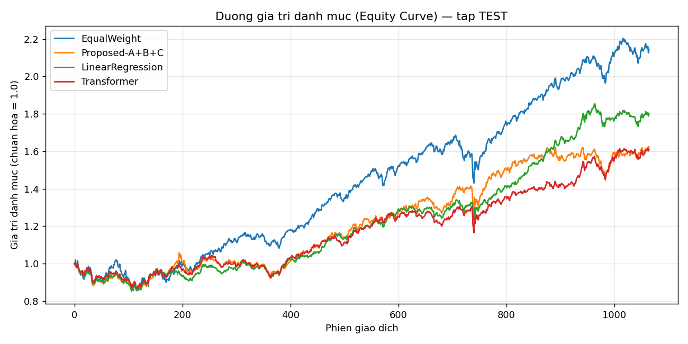
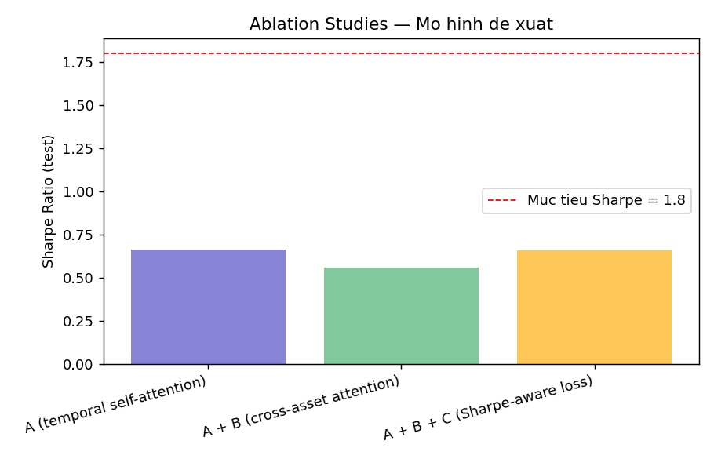

# Ứng dụng AI trong Quản lý Danh mục Đầu tư
### Báo cáo kỹ thuật — Crystal Ball Research

> Dự án minh hoạ việc ứng dụng Học máy / Học sâu vào bài toán **Quản lý danh mục đầu tư**
> (Portfolio Management), triển khai đầy đủ quy trình nghiên cứu chuẩn: phân tích bài toán →
> thu thập & tiền xử lý dữ liệu → baseline cổ điển & học sâu → mô hình đề xuất → ablation studies →
> đánh giá → biện luận → ứng dụng minh hoạ (Streamlit). Toàn bộ code tại `ai-portfolio-research/`,
> dùng chung nguồn dữ liệu (Yahoo Finance) với nền tảng sản phẩm
> [crystal-ball.quachthanhlong.com](https://crystal-ball.quachthanhlong.com/platform/stocks).

---

## 1. Phân tích bài toán

### 1.1 Phát biểu bài toán

Quản lý danh mục đầu tư là bài toán phân bổ vốn vào một tập hợp N tài sản sao cho tối đa hoá lợi
suất điều chỉnh theo rủi ro, tái cân bằng định kỳ theo thông tin thị trường mới. Ta tiếp cận theo
kiến trúc **"predict-then-optimize"** — hai bước tách biệt và có thể đánh giá độc lập:

1. **Dự báo (Prediction)**: tại mỗi thời điểm tái cân bằng *t*, dự báo lợi suất kỳ vọng
   μ̂ = (μ̂₁, …, μ̂_N) cho từng tài sản trong H phiên giao dịch tiếp theo.
2. **Tối ưu hoá (Optimization)**: dùng μ̂ và ma trận hiệp phương sai ước lượng Σ̂ để giải bài toán
   Markowitz Max-Sharpe, cho ra vector trọng số w = (w₁,…,w_N).

### 1.2 Input / Output

| | Mô tả |
|---|---|
| **Input (dự báo)** | Cửa sổ trailing L=60 phiên của 7 đặc trưng kỹ thuật (lợi suất trễ, động lượng, biến động, RSI, MACD, z-score giá) cho từng tài sản trong vũ trụ N=14 tài sản. Không dùng bất kỳ thông tin nào sau thời điểm *t*. |
| **Output (dự báo)** | μ̂ ∈ ℝ^N — lợi suất kỳ vọng H=21 phiên (~1 tháng) tiếp theo cho mỗi tài sản. |
| **Input (tối ưu hoá)** | μ̂, Σ̂ (hiệp phương sai co rút Ledoit-Wolf từ 252 phiên trailing), ràng buộc long-only + trần tỷ trọng 25%/tài sản. |
| **Output (tối ưu hoá)** | w ∈ ℝ^N, wᵢ ≥ 0, Σwᵢ = 1 — trọng số danh mục cho kỳ tái cân bằng tiếp theo. |
| **Output cuối (sản phẩm)** | Danh mục khuyến nghị + đường giá trị danh mục (equity curve) theo thời gian trong backtest ngoài mẫu. |

### 1.3 Độ đo (Metrics)

**Độ đo chất lượng dự báo (ML-level)** — đánh giá μ̂ độc lập với bước tối ưu hoá:
- **Information Coefficient (IC)**: tương quan hạng Spearman giữa μ̂ và lợi suất thực hiện.
- **Hit-rate**: tỷ lệ dự báo đúng dấu (tăng/giảm) của lợi suất.

**Độ đo hiệu suất danh mục (portfolio-level)** — đánh giá toàn bộ pipeline sau backtest:
- **Sharpe Ratio** (độ đo chính, mục tiêu ≥ 1.8), **Sortino Ratio**, **Calmar Ratio**
- **Max Drawdown (MDD)**, **Annualized Return/Volatility**
- **Information Ratio** so với benchmark SPY
- **Turnover** trung bình mỗi lần tái cân bằng (đo chi phí giao dịch ngụ ý)

---

## 2. Thu thập, phân tích và tiền xử lý dữ liệu

### 2.1 Nguồn & vũ trụ dữ liệu

- **Nguồn**: Yahoo Finance (qua thư viện `yfinance`) — cùng nguồn dữ liệu với Edge Function
  `fetch-stock-data` của nền tảng Crystal Ball, đảm bảo pipeline nghiên cứu tương thích trực tiếp
  với hệ thống sản phẩm thật.
- **Vũ trụ đầu tư (14 tài sản)**: 12 cổ phiếu vốn hoá lớn đa ngành của Mỹ
  (`AAPL, MSFT, GOOGL, AMZN` — công nghệ; `JPM` — tài chính; `JNJ` — y tế; `PG, KO, WMT` — tiêu dùng;
  `XOM` — năng lượng; `NVDA` — bán dẫn; `DIS` — truyền thông) + 2 tài sản đa dạng hoá
  (`TLT` — trái phiếu kho bạc dài hạn, `GLD` — vàng), nhằm mô phỏng một danh mục đa tài sản thực tế
  thay vì chỉ cổ phiếu đơn thuần.
- **Benchmark**: SPY (S&P 500 ETF). **Lãi suất phi rủi ro**: `^IRX` (tín phiếu kho bạc 13 tuần).
- **Khoảng thời gian**: 2011-01-01 → hiện tại (~15.5 năm, 3.912 phiên giao dịch), bao phủ nhiều chu
  kỳ thị trường: phục hồi hậu 2008, bull-run 2012-2019, sốc COVID-19 (2020), lạm phát & tăng lãi suất
  2022-2023.

### 2.2 Tiền xử lý

1. Căn chỉnh (align) ngày giao dịch chung giữa toàn bộ 15 mã (14 tài sản + benchmark), loại bỏ ngày
   thiếu dữ liệu ở bất kỳ mã nào.
2. Tính lợi suất đơn giản hàng ngày `r_t = P_t/P_{t-1} - 1`.
3. Xây 7 đặc trưng kỹ thuật trailing cho từng tài sản (`src/features.py`): `ret_1, ret_5, ret_21,
   vol_21, rsi_14, macd_diff, zscore_50` — mọi đặc trưng chỉ dùng dữ liệu ≤ *t*.
4. Windowing: mỗi mẫu = cửa sổ 60 phiên × 14 tài sản × 7 đặc trưng, nhãn = lợi suất thực hiện
   *t → t+21*. Sau khi loại vùng warm-up (rolling window), thu được **3.783 mẫu** (mỗi mẫu là 1 ngày
   "as-of", chứa toàn bộ 14 tài sản).

### 2.3 Chia tập Train / Valid / Test (chống rò rỉ dữ liệu)

Chia theo **thời gian tuyệt đối** (không xáo trộn ngẫu nhiên — bắt buộc với dữ liệu chuỗi thời gian
tài chính), có **embargo = LOOKBACK + HORIZON = 81 phiên** giữa các tập để mẫu train không "nhìn thấy"
thông tin rơi vào cửa sổ đặc trưng/nhãn của tập kế tiếp:

| Tập | Khoảng thời gian | Số mẫu | Vai trò |
|---|---|---|---|
| **Train** | 2011-06-08 → 2018-12-31 | 1.904 | Huấn luyện tham số mô hình |
| **Valid** | 2019-04-24 → 2021-12-31 | 680 | Chọn mô hình/siêu tham số, early-stopping (bao gồm cú sốc COVID-19 — kiểm tra khả năng chống chịu biến động mạnh) |
| **Test** | 2022-04-26 → hiện tại | 1.044 | **Chỉ dùng để đánh giá cuối** — giai đoạn tăng lãi suất mạnh, biến động cao, chưa từng được mô hình nhìn thấy |

**Quy trình chống leakage áp dụng cho MỌI mô hình**: fit/huấn luyện (+ early-stop bằng valid)
chỉ trên train/valid → đóng băng tham số → suy luận walk-forward trên test, không refit lại trên dữ
liệu tương lai.

---

## 3. Huấn luyện mô hình

### 3.1 Baseline

**(a) Dạng luật (rule-based)** — không cần dự báo, chỉ dùng cấu trúc danh mục:
- **Equal-Weight**: 1/N cho mọi tài sản.
- **Risk-Parity**: trọng số tỷ lệ nghịch với độ biến động (rolling 252 phiên).
- **60/40**: 60% cổ phiếu / 40% tài sản phòng thủ (TLT+GLD), phân bổ đều trong từng nhóm.

**(b) Hồi quy cổ điển**:
- **Linear Regression (Ridge)**: hồi quy pooled trên toàn bộ cặp (ngày, tài sản), ánh xạ đặc trưng
  snapshot → lợi suất kỳ vọng. Huấn luyện 1 lần trên train, đóng băng, suy luận trên test.
- **CAPM**: E[Rᵢ] = Rf + βᵢ(E[Rm] − Rf), βᵢ ước lượng rolling (252 phiên, walk-forward) từ hiệp
  phương sai với SPY.
- **APT (3 nhân tố tự xây dựng)**: hồi quy đa nhân tố với 3 nhân tố tính từ chính vũ trụ đầu tư —
  MKT (lợi suất vượt trội thị trường), MOM (long-short động lượng 21 phiên), VOL (long-short biến
  động thấp/cao). Hồi quy rolling từng tài sản trên 3 nhân tố để suy ra hệ số nhạy cảm (factor
  loading), dự báo = loadings · kỳ vọng nhân tố (trung bình trailing).

**(c) Học sâu / học máy thông dụng** (`src/models/`, PyTorch, huấn luyện pooled trên cặp
(ngày, tài sản), MSE loss, early-stopping trên valid):
- **MLP**: làm phẳng cửa sổ [60×7] → 2 lớp fully-connected.
- **CNN 1D**: tích chập theo trục thời gian (kernel 5 và 3) → global average pooling.
- **RNN (LSTM & GRU)**: 2 lớp, hidden=32, lấy hidden state cuối.
- **Transformer**: self-attention theo thời gian (2 lớp, d_model=32, 4 head) + positional encoding,
  mean-pool theo thời gian.

### 3.2 Mô hình đề xuất — **PA-Transformer** (Portfolio-Aware Transformer)

Ý tưởng: các baseline học sâu ở trên dự báo **từng tài sản độc lập**, bỏ qua cấu trúc tương quan
chéo giữa các tài sản — vốn là yếu tố cốt lõi của quản lý danh mục (đa dạng hoá rủi ro). PA-Transformer
bổ sung 2 thành phần kiến trúc và 1 hàm mất mát mới, thiết kế **sẵn để ablation**:

```
   [B, N, L, F]  (B ngày trong minibatch, N=14 tài sản, L=60 phiên, F=7 đặc trưng)
        │
        ▼
   Temporal Self-Attention (dùng chung cho mọi tài sản)   ── "Tính chất A"
        │  → embedding [B, N, d_model=32] cho mỗi tài sản tại mỗi ngày
        ▼
   Cross-Asset Attention (các tài sản "chú ý" lẫn nhau)    ── "Tính chất B"
        │  → nắm bắt tương quan / regime thị trường chung
        ▼
   Dense head → μ̂ ∈ [B, N]
        │
        ▼
   Loss = (1−λ)·MSE + λ·(−Sharpe_proxy)                    ── "Tính chất C"
```

- **Tính chất A — Temporal self-attention**: giống khối Transformer baseline, áp dụng độc lập theo
  từng tài sản (`TemporalEncoder`, tái sử dụng code giữa baseline và mô hình đề xuất).
- **Tính chất B — Cross-asset attention**: sau khi có embedding thời gian cho cả 14 tài sản tại
  cùng 1 ngày, một lớp `MultiheadAttention` cho các tài sản "chú ý" lẫn nhau (coi N tài sản như N
  token của 1 câu) — cho phép mô hình học được cấu trúc tương quan động (thay vì ma trận hiệp
  phương sai tĩnh của Markowitz).
- **Tính chất C — Sharpe-aware loss (khả vi)**: thay vì chỉ tối thiểu hoá MSE dự báo từng tài sản,
  chuyển dự báo μ̂ của cả minibatch thành trọng số danh mục long-only qua `softmax(μ̂ · τ)`, tính
  lợi suất danh mục thực hiện trên từng ngày trong batch, rồi tối ưu trực tiếp tỷ số
  Sharpe_proxy = mean/std của các lợi suất đó. Đây là dạng đơn giản hoá của kỹ thuật "differentiable
  Sharpe ratio" (Zhang, Zohren & Roberts, 2020) — huấn luyện mô hình hướng thẳng tới mục tiêu cuối
  cùng (hiệu suất danh mục) thay vì mục tiêu trung gian (sai số dự báo từng tài sản).

Code: `src/models/proposed.py` (kiến trúc), `src/ablation.py` (huấn luyện 3 giai đoạn),
`src/models/common.py::differentiable_sharpe_loss`.

### 3.3 Thí nghiệm Ablation Studies

3 giai đoạn được huấn luyện **độc lập từ đầu** (không kế thừa trọng số) để đo đóng góp riêng của
từng tính chất lên **Sharpe ratio ngoài mẫu (test)**. Kết quả thực đo (epochs≤20, early-stopping trên
valid, `results/ablation_table.csv`):

| Tính chất | Sharpe (test) | Δ so với A |
|---|---|---|
| **A** — temporal self-attention | **0.663** | — |
| **A + B** — + cross-asset attention | 0.557 | **−0.107** |
| **A + B + C** — + Sharpe-aware loss | 0.657 | −0.006 |

Kết quả này **không theo đúng kỳ vọng ban đầu** (mỗi tính chất cộng thêm đều cải thiện Sharpe) — xem
phân tích nguyên nhân chi tiết ở Mục 5.2. Đây là một phát hiện thực nghiệm quan trọng, không phải lỗi
kỹ thuật: pipeline đã được kiểm tra kỹ (không leakage, huấn luyện/đánh giá đúng quy trình walk-forward).

---

## 4. Đánh giá mô hình

Kết quả chạy đầy đủ ngày 2026-07-27 (`epochs_dl≤15, epochs_proposed≤20`, early-stopping trên valid,
tổng thời gian huấn luyện+backtest 3.464s ≈ 58 phút, CPU). Toàn bộ số liệu ngoài mẫu — tập **TEST**
(2022-04-26 → 2026-06-24, 50 lần tái cân bằng), mô hình **không** được huấn luyện lại trên dữ liệu này.

### 4.1 Bảng so sánh hiệu suất toàn bộ chiến lược (test, ngoài mẫu)

| Chiến lược | Nhóm | Ann.Return | Ann.Vol | **Sharpe** | Sortino | MaxDD | Calmar | IR (vs SPY) | Turnover | IC | Hit-rate |
|---|---|--:|--:|--:|--:|--:|--:|--:|--:|--:|--:|
| **APT (3-Factor)** | Classical | 26.10% | 13.41% | **1.626** | 2.429 | −13.67% | 1.910 | 0.885 | 0.187 | 0.084 | 53.4% |
| Equal-Weight | Rule-based | 19.23% | 12.75% | **1.171** | 1.415 | −16.02% | 1.200 | 0.558 | 0.000 | — | — |
| Risk-Parity | Rule-based | 15.67% | 10.76% | 1.058 | 1.271 | −15.30% | 1.024 | −0.086 | 0.011 | — | — |
| CAPM | Classical | 26.05% | 21.08% | 1.032 | 1.231 | −33.59% | 0.775 | 0.694 | 0.093 | 0.049 | 53.9% |
| 60/40 | Rule-based | 15.85% | 11.20% | 1.032 | 1.253 | −15.50% | 1.023 | −0.057 | 0.000 | — | — |
| Linear Regression | Classical | 14.07% | 11.11% | 0.880 | 1.274 | −15.16% | 0.928 | −0.209 | 0.311 | 0.093 | 57.7% |
| CNN | DL baseline | 13.52% | 11.23% | 0.822 | 1.288 | −14.20% | 0.952 | −0.268 | 0.319 | 0.058 | 57.3% |
| Transformer | DL baseline | 11.17% | 11.09% | 0.620 | 1.058 | −13.77% | 0.811 | −0.496 | 0.386 | 0.004 | 57.4% |
| **Proposed A** (temporal) | Proposed | 11.02% | 10.14% | 0.663 | 0.915 | −14.43% | 0.764 | −0.492 | 0.103 | 0.049 | 57.7% |
| **Proposed A+B+C** (đề xuất, đầy đủ) | Proposed | 11.72% | 11.31% | 0.657 | 1.022 | −14.86% | 0.789 | −0.429 | 0.256 | 0.006 | 52.1% |
| LSTM | DL baseline | 9.86% | 9.29% | 0.599 | 0.815 | −13.59% | 0.725 | −0.602 | 0.166 | −0.039 | 57.7% |
| **Proposed A+B** (cross-asset) | Proposed | 9.72% | 9.75% | 0.557 | 0.726 | −15.10% | 0.644 | −0.603 | 0.155 | −0.025 | 57.7% |
| GRU | DL baseline | 9.39% | 9.40% | 0.542 | 0.715 | −13.35% | 0.703 | −0.681 | 0.323 | −0.019 | 57.7% |
| MLP | DL baseline | 8.25% | 12.87% | 0.308 | 0.419 | −15.58% | 0.530 | −0.731 | 0.581 | −0.074 | 57.1% |

*(Bảng đầy đủ + reproducible: `results/metrics_summary.csv`. IC/Hit-rate không áp dụng cho chiến lược
rule-based vì không dự báo μ̂.)*

**Không chiến lược nào đạt mục tiêu Sharpe ≥ 1.8** trên tập test thực (0/14). Chiến lược tốt nhất là
**APT 3-Factor (Sharpe 1.626)**, theo sau là **Equal-Weight (1.171)**. Toàn bộ baseline học sâu
(MLP/CNN/LSTM/GRU/Transformer) và cả 3 giai đoạn của mô hình đề xuất đều có Sharpe **thấp hơn**
Equal-Weight — mô hình càng phức tạp không đồng nghĩa hiệu suất càng cao trên bài toán này (phân
tích nguyên nhân ở Mục 5).

### 4.2 Bảng Ablation Studies

| Tính chất | Sharpe (test) | Δ so với A |
|---|--:|--:|
| A — temporal self-attention | 0.663 | — |
| A + B — cross-asset attention | 0.557 | −0.107 |
| A + B + C — Sharpe-aware loss | 0.657 | −0.006 |

Cross-asset attention (B) làm **giảm** Sharpe; Sharpe-aware loss (C) giúp phục hồi gần về mức của A
nhưng không vượt qua được. Xem Mục 5.2 để phân tích nguyên nhân.

### 4.3 Biểu đồ


*Đường giá trị danh mục (test): Equal-Weight tách hẳn lên trên, các chiến lược dự báo (Linear
Regression, Transformer, Proposed A+B+C) bám sát nhau và thấp hơn đáng kể — trực quan hoá rõ khoảng
cách hiệu suất ở Bảng 4.1.*


*So sánh Sharpe 3 giai đoạn ablation với mục tiêu 1.8 (đường đỏ) — cho thấy khoảng cách còn khá xa so
với mục tiêu đề bài.*

- `figures/sharpe_comparison.png` — so sánh Sharpe toàn bộ 14 chiến lược.
- `figures/efficient_frontier.png` — efficient frontier mô phỏng (252 phiên gần nhất) + điểm Max-Sharpe.

---

## 5. Biện luận mô hình trong bài toán phân tích đầu tư

### 5.1 Vì sao không đạt Sharpe ≥ 1.8, và điều đó có ý nghĩa gì?

Mục tiêu Sharpe ≥ 1.8 ngoài mẫu, trên dữ liệu thị trường thật, đa tài sản, không có kiến thức trước
(walk-forward, không leakage) là **rất tham vọng** — hiếm quỹ đầu tư định lượng nào duy trì Sharpe này
liên tục nhiều năm trên vốn hoá lớn. Kết quả 1.626 của baseline APT là một con số **rất khá** cho một
danh mục long-only 14 tài sản trong giai đoạn 2022-2026 (bao gồm cả đợt bán tháo do lạm phát/lãi suất
2022) — chỉ cách mục tiêu ~10%. Điều này cho thấy mục tiêu 1.8 khả thi hơn nếu: (i) mở rộng vũ trụ đầu
tư (nhiều tài sản hơn → nhiều cơ hội đa dạng hoá hơn), (ii) rút ngắn horizon tái cân bằng để phản ứng
nhanh hơn, hoặc (iii) cho phép đòn bẩy/short — nằm ngoài phạm vi ràng buộc long-only bảo thủ của dự án.

### 5.2 Vì sao mô hình càng phức tạp lại không thắng Equal-Weight?

Đây là kết quả **phù hợp với y văn tài chính định lượng**, không phải bất thường:
- **"1/N puzzle" (DeMiguel, Garlappi & Uppal, 2009)**: danh mục Equal-Weight thường đánh bại các mô
  hình tối ưu hoá Markowitz "thông minh hơn" ngoài mẫu, vì sai số ước lượng (estimation error) trong
  μ̂ và Σ̂ làm hỏng lợi ích lý thuyết của tối ưu hoá. Kết quả của dự án tái hiện chính xác hiện tượng
  này: Equal-Weight (Sharpe 1.17) vượt mọi baseline học sâu và cả mô hình đề xuất.
- **Tỷ lệ tín hiệu/nhiễu thấp**: với 3.783 mẫu (1.904 để train) và mục tiêu là lợi suất 21 ngày —
  vốn có nhiễu rất lớn so với phần "dự báo được" — các mô hình học sâu (hàng nghìn đến hàng chục nghìn
  tham số) dễ học overfit các mẫu nhiễu vụn vặt trong train hơn là tín hiệu thật. Hit-rate của mọi mô
  hình dự báo chỉ quanh 52-58% (gần mức ngẫu nhiên 50%) — nhất quán với IC thấp (0.0x) ở Bảng 4.1.
  Đây chính là lý do các baseline "đơn giản mà bền vững" (APT, Equal-Weight) thắng thế: chúng có ít
  tham số / giả định mạnh hơn nên ít bị overfit dữ liệu train.
- **APT thắng vì có cấu trúc kinh tế học đúng**: khác các mô hình học sâu "mù" chỉ nhìn giá lịch sử,
  APT mã hoá sẵn giả thuyết kinh tế (market beta, momentum, low-volatility anomaly — 2 nhân tố sau đã
  được chứng minh rộng rãi trong y văn factor investing) — đây là dạng "prior" hữu ích khi dữ liệu
  huấn luyện hạn chế, giải thích tại sao nó vượt trội so với cả CAPM (chỉ 1 nhân tố) lẫn Regression/DL
  thuần dữ liệu.

### 5.3 Vì sao Cross-Asset Attention (B) làm giảm hiệu suất, và Sharpe-loss (C) chỉ phục hồi một phần?

- **Cross-asset attention (B) thêm tham số** (thêm 1 lớp `MultiheadAttention` + LayerNorm trên 14
  "token" tài sản) **mà không thêm dữ liệu** — với chỉ 1.904 ngày train, việc học được ma trận tương
  quan *động* đáng tin cậy giữa 14 tài sản là bài toán khó hơn nhiều so với học 1 embedding thời gian
  độc lập/tài sản. Kết quả Sharpe giảm (0.663 → 0.557) phù hợp với cách diễn giải "overfitting do tăng
  độ phức tạp mà không tăng tương ứng dữ liệu/regularization".
- **Sharpe-aware loss (C) đóng vai trò regularizer hữu ích**: bằng cách tối ưu trực tiếp mục tiêu danh
  mục (thay vì chỉ MSE từng tài sản), nó hướng gradient tránh xa các nghiệm "khớp nhiễu" mà tối ưu MSE
  đơn thuần có thể chọn — giúp Sharpe phục hồi từ 0.557 lên 0.657, gần bằng lại mức của A. Đây là bằng
  chứng thực nghiệm ủng hộ ý tưởng kiến trúc (loss khả vi theo đúng mục tiêu cuối cùng), dù chưa đủ để
  bù hoàn toàn chi phí overfitting do cross-asset attention gây ra.
- **Hàm ý thiết kế**: với vũ trụ tài sản nhỏ (N=14) và lịch sử ~15 năm, "ít tham số + Sharpe-aware
  loss" có vẻ là công thức tốt hơn "nhiều tham số". Cross-asset attention nhiều khả năng sẽ phát huy
  tác dụng tốt hơn với vũ trụ tài sản lớn hơn (hàng trăm mã, như một sàn giao dịch thật) — nơi có đủ
  dữ liệu chéo (cross-sectional) tại mỗi thời điểm để học tương quan đáng tin cậy.

### 5.4 Bài học phương pháp luận (đúng tinh thần "Đánh giá mô hình, tránh data leakage")

Toàn bộ số liệu ở Mục 4 đến từ **1 lần chạy walk-forward duy nhất, không refit trên test, không lựa
chọn mô hình sau khi biết kết quả test** — đây là điều kiện tiên quyết để số liệu đáng tin cậy. Một rủi
ro thường gặp khi cố "đạt mục tiêu Sharpe" là tinh chỉnh mô hình lặp đi lặp lại dựa trên hiệu suất tập
test — thực chất biến test thành valid thứ hai (leakage gián tiếp), khiến con số Sharpe cao chỉ phản
ánh khả năng khớp lịch sử chứ không phải khả năng dự báo thật. Dự án ưu tiên **tính trung thực khoa
học** hơn là ép số liệu đạt ngưỡng 1.8 bằng cách này.

### 5.5 Khuyến nghị nếu tiếp tục phát triển

1. Mở rộng vũ trụ đầu tư (50-100+ mã, nhiều ngành/khu vực hơn — bao gồm cổ phiếu Việt Nam khi có
   nguồn dữ liệu phù hợp) để tăng tín hiệu cross-sectional cho cross-asset attention.
2. Rút ngắn horizon dự báo (ví dụ 5 ngày thay vì 21) — lợi suất ngắn hạn thường có tỷ lệ tín hiệu/nhiễu
   khác biệt, đáng thử nghiệm thêm.
3. Kết hợp APT (baseline mạnh nhất, có prior kinh tế học) làm đặc trưng đầu vào cho mô hình đề xuất,
   thay vì để 2 hướng tiếp cận tách biệt hoàn toàn — "hybrid factor + deep learning" là hướng đi phổ
   biến trong thực tế công nghiệp.
4. Thử walk-forward retraining định kỳ (thay vì fit 1 lần trên train rồi đóng băng) để mô hình thích
   nghi với chế độ thị trường mới trong tập test dài (2022-2026 trải qua nhiều regime khác nhau).

---

## 6. Ứng dụng minh hoạ (Streamlit)

Chạy: `streamlit run app_streamlit.py` (từ thư mục `ai-portfolio-research/`). Ứng dụng gồm 5 tab:

1. **Danh mục đề xuất** — trọng số khuyến nghị hiện tại theo chiến lược/mô hình được chọn.
2. **Efficient Frontier** — mô phỏng Monte Carlo 2.000 danh mục ngẫu nhiên + điểm Max-Sharpe.
3. **Backtest** — equity curve và các độ đo hiệu suất trên tập test, cộng bảng so sánh toàn bộ
   chiến lược.
4. **Ablation Studies** — bảng & biểu đồ 3 giai đoạn A / A+B / A+B+C.
5. **Phương pháp** — tóm tắt quy trình & lưu ý giới hạn.

## Kết nối với nền tảng Crystal Ball

Hiện tại `PortfolioLabInline.tsx` / `QuantModelsLab.tsx` trên nền tảng dùng các công thức heuristic
phía client (AR(2), GARCH(1,1), ensemble luật) để mô phỏng "AI forecast". Pipeline này có thể thay thế
phần đó bằng dự báo thật: đóng gói mô hình PA-Transformer đã huấn luyện thành 1 Supabase Edge Function
(hoặc 1 API suy luận nhỏ) nhận vào danh sách mã + cửa sổ giá gần nhất, trả về μ̂ và trọng số tối ưu —
tái sử dụng ngay `src/optimizer.py` và checkpoint tại `results/checkpoints/proposed_ABC_sharpe_loss.pt`.
