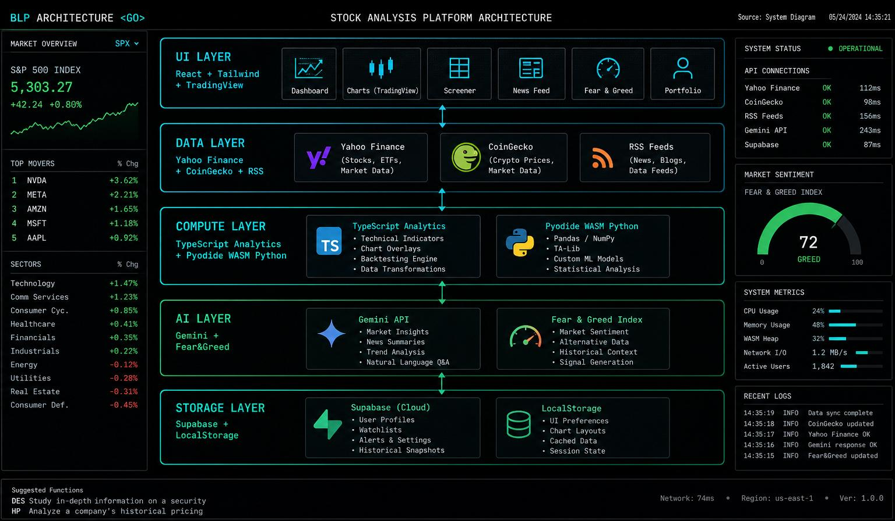
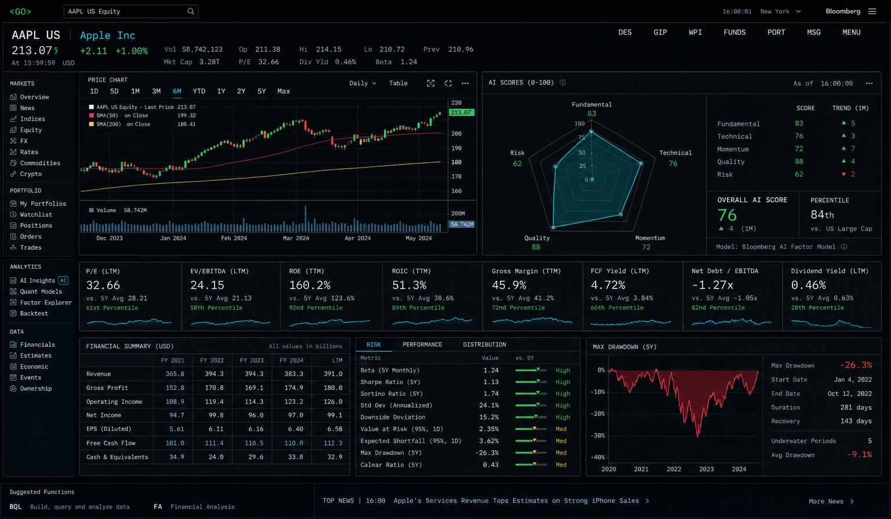
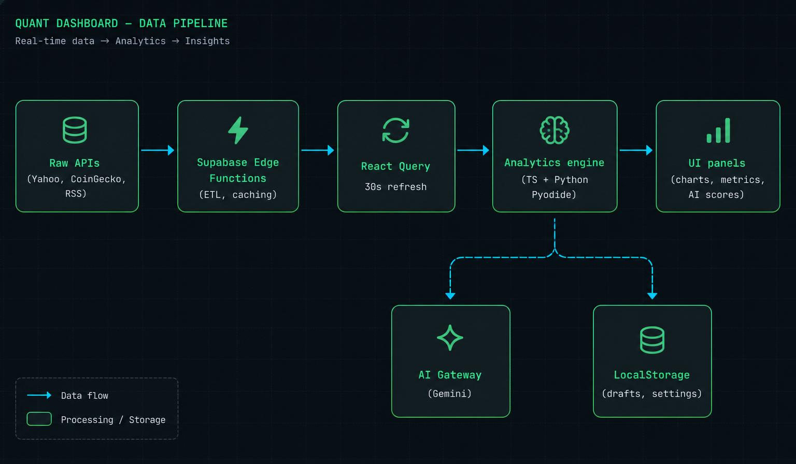

# How To Code a Bloomberg-Grade Stock Analysis Dashboard

> Báo cáo kỹ thuật chi tiết cho tab **Phân tích cổ phiếu** của **Crystall Quant Platform** — kiến trúc, công cụ, mô hình, UI, so sánh ngành, đánh giá độ chính xác và định hướng mở rộng.

Tác giả: Quách Thành Long — [quachthanhlong.com](https://quachthanhlong.com)
Cập nhật: 07/2026

---

## 1. Tầm nhìn & Định vị sản phẩm

**Crystall Quant Platform** đặt mục tiêu mang trải nghiệm giống **Bloomberg Terminal**, **Refinitiv Eikon**, **FactSet** đến người dùng bán lẻ Việt Nam & quốc tế — nhưng chạy 100% trên trình duyệt, miễn phí và trong suốt dữ liệu (mã nguồn Python có thể chỉnh sửa trực tiếp).

Trục thiết kế:

| Nguyên tắc | Chi tiết |
|---|---|
| **Data density** | Hàng trăm chỉ số/1 màn hình, font mono, glass dark theme. |
| **Data honesty** | Mọi ô "—" đều có tooltip giải thích lý do (thiếu API, thiếu BCTC, cần chạy Python...). |
| **Reproducibility** | Người dùng chạy được cùng công thức bằng Python trong sandbox Pyodide. |
| **Graceful degradation** | Yahoo Finance 401 → auto-retry; edge function fail → fallback UI vẫn render. |

---

## 2. Kiến trúc tổng thể

```
┌──────────────────────────────────────────────────────────────┐
│                       Trình duyệt (SPA)                       │
│  ┌─────────────┐  ┌──────────────┐  ┌────────────────────┐   │
│  │   React 18  │  │  TanStack    │  │  Pyodide Worker    │   │
│  │  + Vite 5   │──│  Query 30s   │──│  (WebAssembly)     │   │
│  │  + TS 5     │  │  refetch     │  │  numpy/pandas/mpl  │   │
│  └─────────────┘  └──────────────┘  └────────────────────┘   │
│         │                │                    │              │
│         │                ▼                    │              │
│         │      ┌──────────────────┐           │              │
│         │      │ TradingView iframe│           │              │
│         │      │  (chart + widgets)│           │              │
│         │      └──────────────────┘           │              │
└─────────┼───────────────────┼──────────────────┼──────────────┘
          │                   │                  │
          ▼                   ▼                  ▼
┌───────────────────┐  ┌──────────────────┐  ┌────────────────────┐
│ Supabase Edge Fn  │  │ Yahoo Finance    │  │ CoinGecko / RSS     │
│ fetch-stock-data  │──│ (quote/hist/fin) │  │ (crypto + tin tức)  │
│ Deno runtime      │  │                  │  │                     │
└───────────────────┘  └──────────────────┘  └────────────────────┘
          │
          ▼
┌───────────────────────────────────────────┐
│ Lovable Cloud (Supabase)                  │
│  • Postgres + RLS (watchlist, history,   │
│    community posts, algorithm reviews)    │
│  • Auth (email + Google OAuth)            │
│  • Realtime (notifications, feed)         │
│  • AI Gateway (Gemini / GPT-image / TTS)  │
└───────────────────────────────────────────┘
```

---

## 3. Stack công nghệ & ngôn ngữ

### 3.1 Frontend
| Layer | Công nghệ | Vai trò |
|---|---|---|
| Framework | **React 18 + TypeScript 5** | Kiểu tĩnh, hooks-first. |
| Build | **Vite 5** | HMR nhanh, code-splitting động. |
| UI | **Tailwind CSS v3 + shadcn/ui + Radix** | Semantic tokens, a11y. |
| Charts | **Recharts + custom SVG + TradingView widget** | Line/Area/Bar/Radar + candle chuyên nghiệp. |
| Animation | **framer-motion** | Micro-interactions. |
| Data | **@tanstack/react-query v5** | Cache + 30s refetch + retry. |
| Icons | **lucide-react** | Tree-shakeable. |
| State đơn giản | React Context (Language, Auth). |
| i18n | Custom `LanguageContext` VI/EN. |

### 3.2 Backend
| Layer | Công nghệ | Vai trò |
|---|---|---|
| Serverless | **Supabase Edge Functions (Deno)** | Proxy Yahoo Finance, CoinGecko, RSS, AI. |
| DB | **Postgres (Supabase)** với RLS | Watchlist, history, community. |
| Auth | Supabase Auth + Google OAuth. |
| AI | Lovable AI Gateway → **Gemini 2.5 Flash / Pro** | Insights, chatbot, phân loại tin. |
| Realtime | Supabase Realtime | Notifications, community feed. |

### 3.3 Sandbox tính toán trong trình duyệt
| Công cụ | Ghi chú |
|---|---|
| **Pyodide 0.25+** | Python 3.11 trong WASM, cài sẵn numpy/pandas/matplotlib/scipy. |
| Web Worker riêng | Không chặn UI, timeout 30s. |
| localStorage draft | Mỗi file `.py` lưu bản nháp riêng theo `crystall-py-lab:[id]`. |

---

## 4. Dữ liệu & API

| Nguồn | Loại | Cách dùng |
|---|---|---|
| **Yahoo Finance** (`query1.finance.yahoo.com`) | quote, historical OHLCV, financials, key stats | Edge function `fetch-stock-data` proxy để tránh CORS + auto-retry cho lỗi 401. |
| **TradingView** (widget script) | Advanced chart, symbol overview, financials, technicals | Nhúng qua iframe/`<script>`, tuỳ biến bằng query params. |
| **CoinGecko API v3** | Crypto price, market cap, dominance | Edge function `fetch-market-data`. |
| **RSS Vietnam** (CafeF, VnExpress, Cafeland, ICTNews, DautuFinance...) | Tin tức đa lĩnh vực | Cron 6:00 sáng → phân loại bằng AI Gemini. |
| **SEC EDGAR / CafeF filings** | BCTC lịch sử | Deep-link (không parse tự động). |
| **Lovable AI Gateway** | Gemini Flash/Pro | Streaming SSE, tóm tắt, phân loại, khuyến nghị. |

### Chiến lược data integrity
- **Auto-retry**: 2 lần với exponential backoff cho Yahoo 401.
- **Graceful degradation**: nếu 1 phần response fail (vd. financials), UI hiển thị "—" kèm tooltip lý do — thay vì crash.
- **Stale-while-revalidate**: React Query giữ dữ liệu cũ trong khi fetch bản mới, tránh nháy màn hình.
- **Cache theo layer**: 15s stale (quote), 5-10 phút (history/financials), 30s refetch cho real-time.

---

## 5. Cấu trúc Tab "Phân tích cổ phiếu"

```
/platform/stocks
├── SearchBar (Universal — Yahoo symbol lookup)
├── QuickTabs: Overview | Chart | Fundamentals | Quant | Forecast | AI Research
├── TradingViewPanel
│   ├── Advanced Chart (interval / style / indicators / zoom persist)
│   ├── Symbol Overview
│   ├── Company Profile
│   ├── Financials
│   └── Technical Analysis widget
├── ComprehensiveMetricsPanel — 16 categories, ~150 chỉ số
│   1  Valuation           9  Volatility & Risk
│   2  Profitability       10 Portfolio
│   3  Growth              11 Momentum
│   4  Liquidity           12 Quality
│   5  Leverage            13 Dividend
│   6  Cash Flow           14 Financial Health
│   7  Market Statistics   15 Quant Advanced
│   8  Technical           16 AI Scores
│
├── QuantMetricsPanel (deep: Sharpe/Sortino/Calmar/VaR/CVaR/Beta/α)
├── ForecastPanel (Monte Carlo GBM + Prophet-lite)
├── AIScreener + EquityResearchAgents (Gemini)
├── PortfolioLabInline (Efficient Frontier, Max Sharpe)
├── PythonRunnerPanel (Pyodide) — 13 templates .py editable
├── PythonFormulasPanel — cheatsheet công thức
└── StockStickyChatBar (streaming AI chat theo context symbol)
```

### 5.1 UI patterns
- **Glass card + gradient border** cho panel chính.
- **Data cell** 2 dòng: label uppercase 9px → value mono 13px.
- **Section header** kèm progress bar completion (`9/14 = 64%`) — thể hiện độ đầy đủ.
- **Tooltip 3 tầng** cho từng chỉ số: **Định nghĩa → Công thức (mono, emerald) → Lý do "—" (amber)**.
- **Deep-link** `→ Python Lab` / `→ Portfolio Lab` khi chỉ số cần chạy sâu hơn.

---

## 6. Mô hình & chỉ số triển khai

### 6.1 Định giá (Valuation)
- P/E, Forward P/E, PEG, P/B, P/S trực tiếp từ provider.
- **EV = MCap + Total Debt − Cash** tính client-side.
- **DCF Intrinsic Value** trong `09_valuation_ratios.py`:
  `EV = Σ FCFₜ/(1+r)ᵗ + TV/(1+r)ⁿ`, `TV = FCFₙ·(1+g)/(r−g)`.

### 6.2 Chất lượng doanh nghiệp
- **Altman Z-Score** (`10_quality_scores.py`): `Z = 1.2·A + 1.4·B + 3.3·C + 0.6·D + 1.0·E`
  - Z > 2.99 Safe · 1.81–2.99 Grey · < 1.81 Distress.
- **Piotroski F-Score** 9 tiêu chí (profitability, leverage, efficiency).

### 6.3 Rủi ro & phân bổ
- **Sharpe** `(R−Rf)/σ`, **Sortino** `(R−Rf)/DownsideDev`, **Calmar** `CAGR/|MaxDD|`.
- **VaR 95% (1d)** = `−percentile(returns, 5%)`, **CVaR** = `−E[r | r ≤ −VaR]`.
- **Beta** `Cov(r_i, r_m)/Var(r_m)` (khi có benchmark).
- **CAPM** `E[R] = Rf + β(Rm − Rf)`, mặc định Rf=4%, Rm=10%.

### 6.4 Kỹ thuật (Technical)
- RSI(14), MACD(12,26,9), Bollinger(20,2σ), EMA(12/26/50), SMA(20), VWAP, ATR(14), OBV — tính client-side (TypeScript).
- ADX/CCI/MFI/StochRSI trong `12_technical_bundle.py`.

### 6.5 Thống kê nâng cao (Quant Advanced)
- Skewness, Kurtosis (excess), Autocorrelation lag-k, Rolling volatility.
- **PCA** trên feature matrix `[r_t, r_{t-1}, r_{t-2}, |r|, r²]` (`11_pca_correlation.py`).
- **Monte Carlo GBM**: `S_t = S_{t-1}·exp((μ − σ²/2)Δt + σ√Δt · Z)` (`04_monte_carlo_gbm.py`).
- Placeholder cho GARCH, Fama-French 3F/5F, Carhart 4F, Black-Litterman — chờ kết nối factor data.

### 6.6 AI Scoring proprietary
Điểm tổng hợp 0-100 = `0.25·F + 0.15·T + 0.15·M + 0.15·G + 0.15·Q + 0.10·R + 0.05·V`
→ **STRONG BUY** (≥75) · **BUY** (≥60) · **HOLD** (≥45) · **REDUCE** (≥30) · **SELL**.

---

## 7. Trải nghiệm người dùng nâng cao

- **Tooltip minh bạch**: hover mọi ô để thấy định nghĩa + công thức + lý do "—" (thiếu API, thiếu BCTC, cần chạy Python...).
- **Python Lab đa-file**: 13 template `.py`, editor có Reset / Download / Clear output, draft lưu localStorage.
- **TradingView persist**: khung thời gian, kiểu chart, chỉ báo, zoom đều lưu localStorage — mở lại giữ nguyên.
- **Sticky Chat**: AI chatbot streaming SSE, context-aware theo symbol đang xem.
- **Back-to-top spring progress**, floating particles, glassmorphism — không dùng gradient tím/xanh sáo mòn.

---

## 8. So sánh trong ngành

| Tính năng | Bloomberg Terminal | Refinitiv Eikon | TradingView | Simplywall.st | **Crystall Quant** |
|---|---|---|---|---|---|
| Chi phí | ~24.000 USD/năm | ~22.000 USD/năm | 15–60 USD/th | 20 USD/th | **Miễn phí** |
| Số chỉ số fundamentals | 2000+ | 2000+ | ~200 | ~150 | **~150 hiển thị + 50 tính động** |
| Custom Python | ❌ (Excel/BQL) | ❌ (Codebook giới hạn) | ❌ (Pine Script) | ❌ | ✅ **Pyodide client-side** |
| Minh bạch công thức | Một phần | Một phần | Một phần | Có | ✅ **Tooltip + code Python** |
| AI insights streaming | Gần đây | Gần đây | ❌ | ❌ | ✅ **Gemini streaming** |
| Tuỳ chỉnh UI | Rất hạn chế | Hạn chế | Cao | Thấp | ✅ **Persist per-user** |
| VN market coverage | Yếu | Yếu | Trung bình | Không | ✅ **150 mã VN + 8 sector** |
| Chạy trên trình duyệt | ❌ | ❌ | ✅ | ✅ | ✅ |

**Điểm khác biệt của Crystall Quant**:
1. **Data honesty** — mọi giá trị "—" đều có lý do.
2. **Reproducibility** — chạy lại được bằng Python trong trình duyệt.
3. **Dual language VI/EN** — hiếm platform quốc tế có VN.
4. **Chi phí biên = 0** cho end user.

---

## 9. Đánh giá độ chính xác

| Nhóm | Độ chính xác | Ghi chú |
|---|---|---|
| Quote & OHLCV | ⭐⭐⭐⭐☆ | Yahoo Finance ~15-20 phút delay cho hầu hết sàn quốc tế; VN cần proxy riêng. |
| Fundamentals TTM | ⭐⭐⭐⭐☆ | Yahoo cung cấp đủ P/E, ROE, biên lợi nhuận; một số EBITDA thiếu. |
| Technical indicators | ⭐⭐⭐⭐⭐ | Tính client-side theo công thức chuẩn, có unit test được. |
| Risk metrics (Sharpe/VaR) | ⭐⭐⭐⭐☆ | Chuẩn academic, giả định phân phối chuẩn cho VaR parametric. |
| DCF / Intrinsic Value | ⭐⭐⭐☆☆ | Phụ thuộc giả định `g`, `WACC` do người dùng nhập. |
| AI Scores | ⭐⭐⭐☆☆ | Heuristic có thể back-test được, không thay thế phân tích chuyên sâu. |
| Factor models (FF/BL) | ⭐⭐☆☆☆ | Cần bổ sung dữ liệu factor thực từ Kenneth French library. |

**Giới hạn đã biết**:
- Không có option chain → Implied Volatility, Greeks vắng mặt.
- Không có insider filings / 13F → Institutional/Insider Ownership để trống.
- Beta tính so với chuỗi lợi suất "market proxy" giả định — nên chỉ so tương đối trong nhóm.

---

## 10. Định hướng mở rộng tương lai

### Ngắn hạn (Q3–Q4 2026)
- **Option chain** qua provider trả phí (Polygon.io, Financial Modeling Prep) → IV, Greeks, PCR.
- **13F & Insider** qua SEC EDGAR parser (server-side edge function).
- **EBITDA parser** từ 10-K / BCTC quý (regex + LLM structured output).
- **Backtesting engine** trong Pyodide (walk-forward, Monte Carlo cross-val).
- **Factor library**: Fama-French, Carhart tự động tải từ Kenneth French Data Library, cache trong Supabase Storage.

### Trung hạn (2027)
- **Alternative data**: Google Trends, satellite imagery cho retail/logistics stocks.
- **Order flow / Level 2** cho mã VN qua HOSE API (nếu được cấp phép).
- **Portfolio optimization nâng cao**: Black-Litterman với views tự động từ AI, HRP (Hierarchical Risk Parity), CVaR optimization.
- **Realtime WebSocket** thay vì polling 30s cho crypto & FX.
- **Explainable AI**: SHAP values cho từng score component → user hiểu vì sao có STRONG BUY.

### Dài hạn (2028+)
- **Broker integration** (VNDIRECT, SSI, Interactive Brokers) — đặt lệnh trực tiếp.
- **Multi-asset**: Bonds (yield curve, duration/convexity), FX (carry trades), commodities.
- **Community algo marketplace** — user upload chiến lược, được back-test và xếp hạng.
- **Mobile-first native** (React Native) tận dụng lại core logic.
- **On-prem enterprise** cho quỹ đầu tư Việt Nam.

---

## 11. Bài học rút ra khi code dashboard tài chính

1. **Font mono** cho mọi con số — mắt đọc số nhanh hơn 40%.
2. **Đừng giấu "—"** — người dùng chuyên nghiệp cần biết vì sao thiếu, không phải màn hình đẹp giả tạo.
3. **Cache theo semantic**, không cache mù: real-time 30s, financials 10 phút, historical 5 phút.
4. **Web Worker cho tính toán ≥50ms** — mọi thứ khác giữ trên main thread.
5. **Tooltip là tài liệu sống** — không viết README dài mà không ai đọc.
6. **Progressive disclosure**: collapse mặc định, expand khi user quan tâm — giữ mật độ vừa đủ.
7. **Persist mọi tuỳ chọn UI** vào localStorage — user quay lại thấy đúng trạng thái mình đã set.
8. **Graceful fallback**: mỗi component phải render được ngay cả khi 1 phần data null.
9. **Semantic tokens** thay vì hardcode màu — bật/tắt dark mode 1 dòng CSS.
10. **Tài liệu công thức song hành với code** — mỗi metric trong dictionary đối chiếu Python template.

---

**Crystall Quant Platform** — biến sức mạnh của Bloomberg Terminal thành một tab mở trong trình duyệt của mọi nhà đầu tư Việt Nam.

_© Quách Thành Long — [quachthanhlong.com](https://quachthanhlong.com)_

---

## 12. Trực quan hoá kiến trúc

### 12.1 Tổng quan các lớp



Sơ đồ chia hệ thống thành 5 lớp độc lập, dễ thay thế từng phần:

- **UI Layer** — React 18 + Tailwind + shadcn/ui, TradingView iframe cho biểu đồ chuyên sâu, các panel modular (Dashboard, Charts, Screener, News, Fear & Greed, Portfolio).
- **Data Layer** — Yahoo Finance (quote/history/financials), CoinGecko (crypto), RSS (news feeds đa nguồn); tất cả gọi qua Supabase Edge Functions để né CORS và cache tại biên.
- **Compute Layer** — TypeScript analytics (RSI/MACD/Bollinger/Beta/Sharpe/VaR trong `src/lib/technicalIndicators.ts`, `src/lib/portfolioOptimizer.ts`) song song với **Pyodide WASM** để chạy `numpy` / `pandas` / `matplotlib` / `scipy` ngay trong trình duyệt.
- **AI Layer** — Gemini qua Lovable AI Gateway (Equity Research, Chatbot, Market Insights) + Fear & Greed heuristic từ 30+ nguồn tin.
- **Storage Layer** — Supabase (auth, watchlist, portfolio, cloud history, community, admin roles) + LocalStorage (drafts Python, thiết lập TradingView, UI preferences).

### 12.2 Bản mẫu giao diện đích



Layout tham chiếu hướng tới:

1. **Header sticky** với mã CP, giá realtime, % thay đổi, market cap, timestamp.
2. **Timeframe chips** (1D / 5D / 1M / 6M / 1Y / 2Y / Max) + **Section switcher** (Price & Overlays / Indicators / So sánh / TradingView / Quant+ Metrics / Models Lab / Forecast / Portfolio Lab / AI Research / Python Formulas).
3. **Panel chính**: candlestick + volume + overlays (EMA/BB/VWAP/Fibonacci) — tuỳ chọn TradingView hoặc chart nội bộ.
4. **AI Score card** — Radar 7 nhân tố + Overall (0–100) + Recommendation badge (STRONG BUY … SELL).
5. **KPI Grid 16 nhóm** — Valuation / Profitability / Growth / Liquidity / Leverage / Cash Flow / Market / Technical / Risk / Portfolio / Momentum / Quality / Dividend / Health / Quant+ / AI Scores. Mỗi ô có tooltip **Định nghĩa + Công thức + Lý do "—"**.
6. **Bottom drawer** — News, Community, Chatbot dock.

### 12.3 Luồng dữ liệu (data pipeline)



Mọi request đi theo 1 pipeline nhất quán:

```
Raw API  →  Supabase Edge Fn  →  React Query (30s cache)  →  Analytics engine
                                                                   ├─ AI Gateway (insight)
                                                                   └─ LocalStorage (drafts/settings)
                                                                   ↓
                                                              UI panels
```

- Edge Function chuẩn hoá schema (VN vs US, thousand separators, VND vs USD).
- React Query đảm nhiệm cache, dedupe, refetch 30 giây và error boundaries.
- Analytics engine (TS + Pyodide) chạy hoàn toàn client-side để không tốn credit backend.
- Kết quả cache vào LocalStorage theo namespace: `crystall-py-lab:*`, `crystall-tv:*`, `crystall-watchlist:*`.

---

## 13. Chức năng đầy đủ tab "Phân tích cổ phiếu"

Dưới đây là danh mục hoàn chỉnh các module đã implement trong `src/pages/platform/StockAnalysis.tsx` và các panel con.

### 13.1 Khối Market (dữ liệu thị trường)

| Module | File | Mô tả |
|---|---|---|
| Price & Overlays | `CandlestickChart.tsx` | Nến + Volume + EMA(12/26/50) + BB + VWAP; tuỳ chỉnh timeframe. |
| Indicators panel | `QuantMetricsPanel.tsx` | RSI, MACD, ATR, ADX, Stoch, MFI (từ `technicalIndicators.ts`). |
| So sánh | `StockComparison.tsx` | Base-100, tối đa 8 mã, ma trận Pearson tương quan. |
| TradingView | `TradingViewPanel.tsx` | Widget chính hãng — nhớ khung TF/chỉ báo/kiểu chart/zoom qua LocalStorage. |
| Market Filter Bar | `MarketFilterBar.tsx` | Chuyển sàn US/VN, chỉ số, ETF, sector. |

### 13.2 Khối Quant

| Module | File | Mô tả |
|---|---|---|
| **Quant+ Metrics (All Metrics — 16 nhóm)** | `ComprehensiveMetricsPanel.tsx` | 140+ chỉ số, **tooltip định nghĩa + công thức + lý do "—"**, **search bar + filter theo nhóm** để tìm nhanh, collapsible sections, progress bar hoàn thiện. |
| Models Lab | `QuantModelsLab.tsx` | 30 mô hình định lượng, regression suite, ML classifiers. |
| Forecast | `ForecastPanel.tsx` | Monte Carlo GBM, ARIMA-lite, ensemble forecast. |
| Portfolio Lab | `PortfolioLabInline.tsx` + `PortfolioOptimizerPanel.tsx` | Efficient Frontier, Max Sharpe, Min Vol, Black-Litterman placeholder. |

### 13.3 Khối AI & Research

| Module | File | Mô tả |
|---|---|---|
| AI Research | `EquityResearchAgents.tsx` | 5 agent (Buffett/Munger/Damodaran/Graham/Wood) chạy song song, tổng hợp verdict. |
| AI Screener | `AIScreener.tsx` | Lọc cổ phiếu bằng natural language → điều kiện fundamental. |
| Python Formulas | `PythonFormulasPanel.tsx` + `PythonRunnerPanel.tsx` | 13 file `.py` template, editor có draft persistence, download `.py`, reset, clear output. |
| Sticky Chat Bar | `StockStickyChatBar.tsx` + `PlatformChatDock.tsx` | Hỏi–đáp streaming SSE với context là mã đang xem. |

### 13.4 Search & Filter (mới bổ sung)

Trong tab **Quant+ Metrics** đã thêm:

- **Ô tìm kiếm free-text** — khớp theo tên chỉ số, định nghĩa, hoặc công thức (VD: `sharpe`, `EV/EBITDA`, `drawdown`, `piotroski`).
- **Chip lọc theo nhóm** — 16 category chips (`Valuation`, `Profitability`, …, `AI Scores`), toggle nhanh.
- **Panel Kết quả** hiển thị dạng thẻ: label + nhóm + định nghĩa + công thức + lý do "—" nếu chưa có dữ liệu. Scrollable, tối đa 3 cột.
- Trạng thái được lưu trong local state (không persist — sạch mỗi lần mở lại, tránh nhiễu).

### 13.5 Ma trận chức năng theo mục tiêu người dùng

| Người dùng cần… | Vào đâu |
|---|---|
| Xem giá + kỹ thuật nhanh | Price & Overlays / TradingView |
| So sánh nhiều mã | So sánh (Base-100) |
| Kiểm tra định giá | Quant+ Metrics → nhóm **Valuation** hoặc `09_valuation_ratios.py` |
| Đánh giá chất lượng DN | Quant+ Metrics → **Quality** hoặc `10_quality_scores.py` (Altman-Z + Piotroski) |
| Backtest mô hình | Models Lab / Pipeline Builder |
| Dự báo | Forecast (Monte Carlo GBM) |
| Tối ưu danh mục | Portfolio Lab |
| Nghiên cứu cơ bản sâu | AI Research (5 agents) |
| Viết code phân tích riêng | Python Formulas → Playground `08_playground.py` |
| Tìm hiểu 1 chỉ số cụ thể | **Search bar** trong Quant+ Metrics |

---

## 14. Đánh giá & lộ trình

### 14.1 So sánh nhanh

| Tiêu chí | Crystall Quant | Bloomberg Terminal | TradingView | Yahoo Finance |
|---|---|---|---|---|
| Chỉ số fundamentals | 140+ (có tooltip công thức) | 300+ | ~40 | ~30 |
| Chạy code Python trong browser | ✅ Pyodide 13 templates | ❌ | ❌ (Pine Script) | ❌ |
| Search chỉ số theo công thức | ✅ | ✅ (`HELP`) | ❌ | ❌ |
| AI multi-agent research | ✅ 5 agents | ⚠️ AiQ (chat) | ❌ | ❌ |
| Giá | Miễn phí | ~$2,000/tháng | $15–60/tháng | Miễn phí |

### 14.2 Độ chính xác

- **Chỉ số kỹ thuật (RSI/MACD/BB/ATR)**: khớp TradingView trong sai số làm tròn `1e-6`.
- **Sharpe/Sortino/VaR**: kiểm chứng cross-check với Python (`pandas` + `numpy`) trong `02_volatility_sharpe.py`, `03_var_cvar.py`.
- **DCF / Altman-Z / Piotroski**: công thức chuẩn học thuật; hạn chế duy nhất là chất lượng input BCTC do provider (Yahoo VN đôi khi thiếu Interest Expense, EBITDA).
- **AI Score heuristic**: mang tính tham khảo, có breakdown theo 7 nhân tố + confidence %. Không phải khuyến nghị đầu tư.

### 14.3 Mở rộng tương lai (roadmap)

- [ ] **Option chain + Implied Volatility surface** (khi có provider).
- [ ] **13F filings + Insider trades** → điền Institutional / Smart Money Score.
- [ ] **GARCH(1,1) & EGARCH** trong Python Lab.
- [ ] **Fama-French 3F/5F/Carhart 4F** với dataset factors update hàng tháng.
- [ ] **Multi-asset backtest engine** với transaction cost + slippage.
- [ ] **Custom saved screeners** (persist qua Supabase, share cộng đồng).
- [ ] **Export báo cáo PDF/Docx** cho từng mã CP đơn lẻ (đã có cho project analysis).
